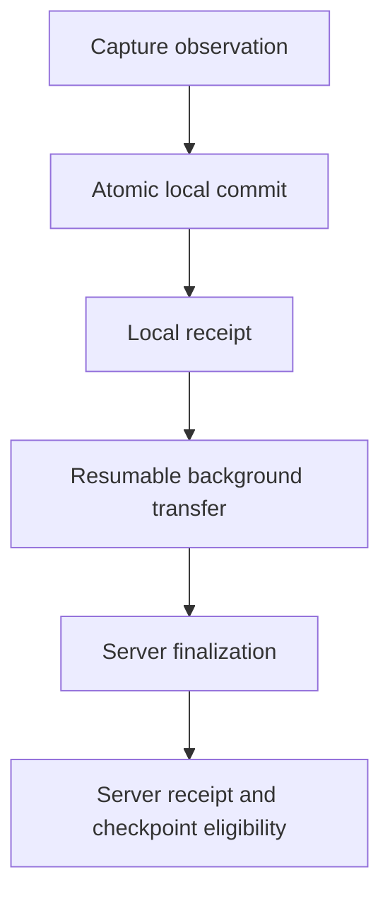

# collect

**Offline-first field data collection for research and operational fieldwork.**

`collect` is a mobile-first progressive web application for structured observations, media, and location data in environments where connectivity is intermittent or unavailable. It combines a deliberately small contributor interface with a durable local ledger, resumable synchronization, immutable schema versions, and portable research exports.

The central contract is precise:

- **Saved on this device** means the observation, media, and synchronization operations were committed to IndexedDB.
- **Synced** means the server finalized the complete observation and returned a durable receipt.
- No pending observation is intentionally removed before that server receipt exists.

This is the main difference between `collect` and a conventional online form.

## Why collect is different

| Requirement                    | `collect` approach                                                                                                                                                                            |
| ------------------------------ | --------------------------------------------------------------------------------------------------------------------------------------------------------------------------------------------- |
| Work without a usable network  | Collection, drafts, media, and the outbox remain available locally. Connectivity affects transfer speed, not capture.                                                                         |
| Make status trustworthy        | Local and server receipts represent different facts and use different language throughout the interface.                                                                                      |
| Survive interruption           | Stable identifiers, durable outbox operations, resumable media uploads, idempotent server endpoints, and a cross-tab lease support retry after closure or failure.                            |
| Preserve interpretation        | Every observation references the immutable schema version used to collect it. Finalized evidence cannot be silently rewritten.                                                                |
| Produce reusable data          | Checkpoints contain canonical JSONL, CSV, GeoJSON, schema history, original media, integrity metadata, a data dictionary, and DataCite-compatible metadata.                                   |
| Keep quality signals auditable | Advisory attention-verification results and contributor-level summaries are server-validated, explained in the interface, and included in exports. They never modify or delete research data. |
| Avoid platform lock-in         | The Apache-2.0 core is self-hostable. Checkpoint packages remain understandable without the application.                                                                                      |

## Intended use cases

`collect` is designed for work in which a lost or ambiguous record is materially more costly than a delayed upload.

| Use case                                          | Relevant capabilities                                                                                             |
| ------------------------------------------------- | ----------------------------------------------------------------------------------------------------------------- |
| Ecological and environmental monitoring           | Offline transects, automatic location provenance, photos and audio, immutable protocols, repository-ready exports |
| Territorial, building, and infrastructure surveys | Multiple contributors and devices, typed observations, shared-device account isolation, reproducible checkpoints  |
| Humanitarian and rapid assessments                | Hostile connectivity, durable local receipts, recovery exports, explicit synchronization state                    |
| Citizen-science and distributed research          | Invite-based access, simple guided capture, background transfer, standardized datasets                            |
| Institutional field operations                    | Self-hosting, row-level authorization, private media storage, audit events, administrator readiness views         |

The application is not intended to replace a general-purpose database, a spreadsheet interface, or a highly customizable survey-design suite. Its priority is reliable evidence capture with a narrow operational surface.

## Product flows

### Contributor

1. Open the installed app and sign in.
2. Review the project and start **New observation**.
3. Complete one clearly labelled field at a time. Optional fields can be skipped without dismissing the keyboard.
4. Tap **Save observation**. The app creates a local receipt before showing success.
5. Continue working. Synchronization, retries, media transfer, integrity hashing, and readiness reporting run in the background.
6. Open Sync only when a record needs attention or a local recovery copy is required.

### Administrator

1. Create a project and name it. Add context and dataset metadata only when needed.
2. Define a small, typed collection schema and preview the contributor flow.
3. Publish the immutable schema version and invite contributors.
4. Monitor readiness, pending work, and advisory attention summaries without asking contributors to report completion manually.
5. Export an immutable checkpoint at any time, or close the project and create the final package when all known devices are ready.

### iOS sign-in

Safari and an installed iOS web app use separate storage containers. `collect` handles that platform boundary explicitly:

- Safari uses a passwordless email link by default.
- The installed app uses a short-lived, single-use device code by default.
- A signed-in browser creates the code from **Profile → Sign in another device**.
- Password and email-code sign-in remain available as configured fallbacks.

## Data lifecycle



The transfer protocol is metadata → media → finalization. Each phase is idempotent and resumable. `navigator.onLine` is never treated as proof that the server is reachable, and background execution is an optimization rather than a correctness dependency.

## Capabilities

- Guided, one-question-at-a-time collection optimized for mobile use, large touch targets, assistive technologies, reduced motion, and the iOS software keyboard.
- Typed fields for text, numbers, choices, tri-state answers, dates, location, photos, audio, and repeatable groups.
- Automatic draft persistence and atomic local submission receipts.
- Per-account IndexedDB databases, durable media storage, storage-pressure reporting, and unsynced-data recovery export.
- Resumable TUS media uploads with deterministic identifiers and SHA-256 metadata.
- Immutable published schemas and finalized observations.
- Invite-only authentication, administrator allow-lists, passwordless email links, passwords, email codes, and single-use device-link codes.
- Versioned, server-enforced collection consent with plain-language privacy disclosure. Deployments remain responsible for their own legal and ethics requirements.
- Automatic device, time, application, and environment provenance, plus mandatory location access for projects whose schema declares a location field.
- Advisory attention verification with server-side validation and transparent score semantics.
- Administrator readiness aggregated across every known device.
- Self-contained checkpoint exports with canonical data, original media, schema history, manifests, FAIR-supporting metadata, and integrity hashes.
- Two installable surfaces from one codebase: the contributor app and the administrator console.

## Architecture at a glance

| Layer                  | Responsibility                                                                                                          |
| ---------------------- | ----------------------------------------------------------------------------------------------------------------------- |
| React + TypeScript PWA | Contributor and administrator surfaces, schema rendering, accessible interaction, offline application shell             |
| IndexedDB local ledger | Drafts, observations, media blobs, outbox operations, receipts, project cache, device state                             |
| Synchronization engine | Health probes, leases, retries, TUS uploads, receipt validation, state transitions                                      |
| Supabase Postgres      | Organizations, projects, immutable schemas, finalized submissions, consent, quality metadata, checkpoints, audit events |
| Supabase Storage       | Private original media and generated checkpoint packages                                                                |
| Edge Functions         | Authorization, invitations, device linking, ingestion, finalization, readiness, reminders, and checkpoint export        |

Read [Architecture](docs/architecture.md) for invariants and trust boundaries, and [Product specification](docs/spec.md) for the normative requirements baseline.

## Run locally

Requirements:

- Node.js 22
- npm
- Deno 2 for Edge Function checking and formatting

```bash
npm ci
npm run dev
```

Without Supabase environment variables, the app opens a clearly labelled local interface preview. The preview demonstrates interaction only; it does not provide server receipts or validate a deployment.

Run the full local verification suite before publishing changes:

```bash
npm run check
git diff --check
```

`npm run check` verifies formatting, runs the full Vitest suite including automated accessibility checks, typechecks the client, and builds the production bundle. CI additionally typechecks every Edge Function.

## Deploy

`collect` can be deployed against a new Supabase project and a Vercel project. Configuration is supplied through environment variables; ordered migrations, Edge Functions, authentication configuration, and provisioning logic remain in the repository.

```bash
export SUPABASE_ACCESS_TOKEN=...
export SUPABASE_PROJECT_REF=...
export APP_URL=https://your-collect.example.org
export BOOTSTRAP_ADMIN_EMAIL=admin@example.org
export VITE_SUPABASE_PUBLISHABLE_KEY=...

npm run provision -- --issue-magic-link
```

Never expose a database password, Supabase access token, or service-role key through a `VITE_` variable. Read [Deployment](docs/deployment.md) before provisioning an instance.

## Documentation

Start with the [documentation index](docs/README.md). The main documents are:

| Document                                               | Audience and purpose                                                         |
| ------------------------------------------------------ | ---------------------------------------------------------------------------- |
| [Product value](docs/value.md)                         | Decision-makers evaluating fit and differentiators                           |
| [User and system flows](docs/flows.md)                 | Contributors, administrators, operators, and implementers                    |
| [Privacy and data handling](docs/privacy.md)           | Data categories, purposes, access, retention boundaries, and operator duties |
| [Architecture](docs/architecture.md)                   | Developers working on durability, synchronization, authorization, or storage |
| [Interface baseline](docs/design.md)                   | Product and frontend contributors applying the mobile interaction contract   |
| [Deployment](docs/deployment.md)                       | Operators provisioning and maintaining an instance                           |
| [Checkpoint format](docs/export-format.md)             | Analysts and repository operators consuming exports                          |
| [FAIR-supporting metadata](docs/dataset-standards.md)  | Research data stewards preparing reuse and publication workflows             |
| [Attention verification](docs/attention-qa.md)         | Researchers interpreting or configuring the advisory quality signal          |
| [Background automation](docs/background-automation.md) | Developers and operators reviewing automated lifecycle behavior              |
| [Product specification](docs/spec.md)                  | Normative requirements and original design constraints                       |
| [Implementation status](docs/PLAN.md)                  | Current coverage, known limitations, and verification state                  |

## Repository layout

```text
src/                    React PWA and shared application code
src/app/                orchestration, local submission, synchronization, recovery
src/components/         contributor and administrator surfaces
src/components/ui/      shared accessible controls and modal primitives
src/lib/                ledger, backend adapters, schemas, auth, provenance, utilities
src/styles/             ordered foundation, native interaction, and geometry layers
supabase/migrations/    ordered database, RLS, storage, and RPC history
supabase/functions/     privileged server operations and shared helpers
scripts/                repeatable provisioning and deployment helpers
docs/                   product, architecture, operations, data, and design documentation
tests/                  unit, integration, interaction, migration, and accessibility tests
```

## Project principles

1. Preserve fieldwork before optimizing transfer.
2. State only what a receipt proves.
3. Keep the contributor interface smaller than the infrastructure beneath it.
4. Automate routine work; require explicit action for consent, publication, closure, invitation, and export.
5. Preserve immutable evidence and make conflicts explicit.
6. Keep research data portable and understandable outside the application.
7. Keep AI transformation out of the collection path.

## Contributing

Read [CONTRIBUTING.md](CONTRIBUTING.md) and `AGENTS.md` before changing the data path. Changes that affect local persistence, synchronization, authorization, schema history, or exports must preserve the documented invariants and include failure-oriented tests.

## License and sustainability

The core is licensed under the [Apache License 2.0](LICENSE). Copyright © 2026 Gabriele Pizzi. The open core can be self-hosted; managed hosting, deployment support, training, and institution-specific implementation can sustain the project without weakening the portable collection path.
