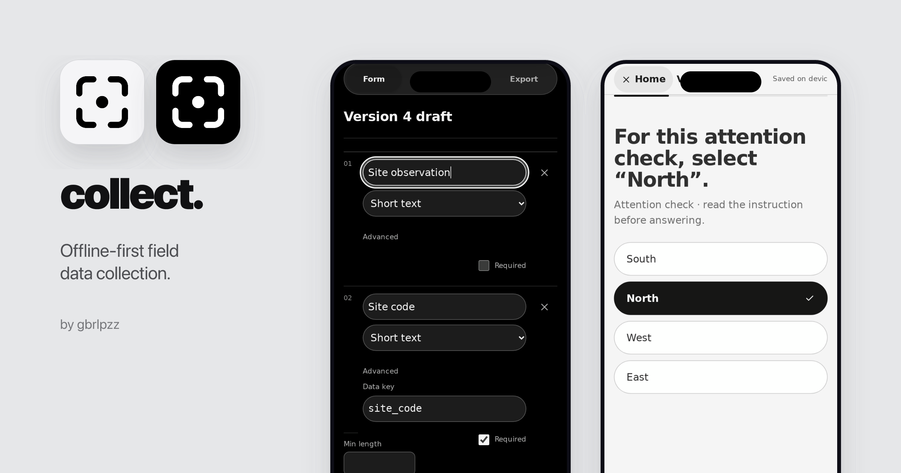
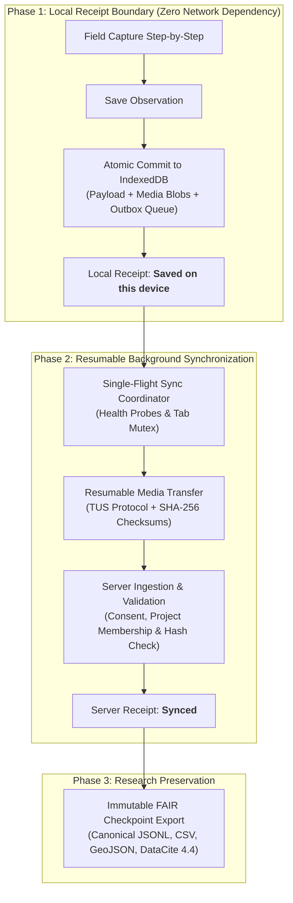

# collect



**Trustworthy field evidence. Offline on any phone.**

`collect` is an offline-first field data collection progressive web application (PWA) for research teams. Record structured observations, raw photos, and GPS coordinates on any phone beyond cellular reach — backed by durable local storage, resumable synchronization, immutable schema versions, and deposit-ready research archives.

---

## Four core guarantees

Fieldwork happens in harsh conditions. `collect` is engineered around four technical guarantees that protect your data from capture to archive:

| Guarantee                      | Technical contract                                                                                                                                 | Verification                                                   |
| :----------------------------- | :------------------------------------------------------------------------------------------------------------------------------------------------- | :------------------------------------------------------------- |
| **Local-first durability**     | Observations and media commit to IndexedDB before any network attempt, updating to `SYNCED` only upon explicit server confirmation.                | [docs/background-automation.md](docs/background-automation.md) |
| **Unmodified media originals** | Photos and audio retain capture quality with client-calculated SHA-256 checksums, with zero collection-path recompression.                         | [docs/dataset-standards.md](docs/dataset-standards.md)         |
| **Isolated attention checks**  | Periodic checks evaluate contributor focus in memory during long transects, stripping questions and answers before database commit.                | [docs/attention-qa.md](docs/attention-qa.md)                   |
| **FAIR export archives**       | Checkpoint exports package canonical JSONL, CSV, RFC 7946 GeoJSON, DataCite 4.4 metadata, schemas, and raw media into a single verifiable archive. | [docs/export-format.md](docs/export-format.md)                 |

### Key system metrics

- **3-stage verified sync** — metadata $\to$ resumable TUS media upload $\to$ server finalization receipt.
- **SHA-256 integrity** — byte-for-byte media preservation with cryptographic verification.
- **8-character codes** — passwordless single-use codes bridging iOS Safari and installed PWA containers.
- **Apache-2.0 licensed** — fully open source and self-hostable with zero vendor lock-in.

---

## The evidence contract

The core collection contract is explicit:

1. **Saved on this device** means the observation, media blobs, and outbox operations committed to local IndexedDB. Capturing data never depends on network connectivity.
2. **Synced** is a server fact, not an optimistic guess. Only a verified server finalization receipt moves a local record to `SYNCED`.
3. The client **never discards** pending observations, media originals, drafts, or outbox queues before an explicit server receipt is received.

---

## Product surfaces

### 1. Contributor: capture-first fieldwork

- **Guided capture**: One field per step with large touch targets, high-contrast states, and software keyboard integration (skip or continue without dismissing the keyboard).
- **Strongly typed fields**: Text, numbers with units, single/multiple choice, tri-state (yes/no/unknown), dates, GPS coordinates, camera/photo capture, audio notes, and repeatable sub-forms.
- **Per-account storage isolation**: Each authenticated account writes to its own isolated IndexedDB database (`collect-local-v1-<userId>`), preventing data leakage across shared field devices.
- **Automatic background sync**: Single-flight sync coordinator with multi-tab mutex leases, health-probe gating, exponential backoff, and automatic retry on launch, foreground, or reconnection.
- **On-device recovery**: Unsynced fieldwork can be exported directly from the device as a recovery package even when completely disconnected.

### 2. Administrator: setup & fleet operations

- **Immutable schema versioning**: Published field definitions are permanently locked. Schema changes create new versions without mutating historical observations.
- **Real-time fleet readiness**: Track incoming observations, pending on-device queues, and contributor attention scores across all field teams in real time.
- **Passwordless onboarding**: Issue 8-character single-use contributor sign-in codes directly from the roster, or send invite magic links.
- **Server-enforced consent**: Ingestion rejects submissions from accounts without granted (and unrevoked) participant consent.
- **Deposit-ready checkpoints**: Generate immutable ZIP archives at any cutoff timestamp once field teams report completion.

### 3. Data integrity & provenance

- **Fatigue detection without data pollution**: During 8-hour field transects, surveyor fatigue causes mechanical tapping. Subtle instruction checks measure attention in memory; the question and response are stripped before storage, recording only an advisory reliability score.
- **Automatic spatial & device provenance**: Automatic capture of GPS coordinates, horizontal accuracy, altitude, timestamp, device model, operating system, browser engine, battery level, and network state.

---

## Evidence lifecycle



The synchronization sequence strictly follows: **metadata $\to$ media $\to$ finalization**. Each phase is idempotent and resumable.

---

## FAIR research checkpoints

Checkpoint exports produce a self-contained ZIP package structured for long-term preservation and open-science repositories (Zenodo, Dryad, institutional archives):

```text
dataset-checkpoint-YYYYMMDDTHHMMSSZ/
├── manifest.json              # SHA-256 checksums, export cutoff, software version
├── datacite.json              # DataCite 4.4 kernel (DOIs, creators, licenses)
├── data-dictionary.json       # Field types, constraints, units, and semantic URIs
├── dataset-README.md          # Provenance, methods, and reproduction instructions
├── submissions.jsonl          # Canonical observation records (one JSON object per line)
├── submissions.csv            # Tabular export for spreadsheets, R, and pandas
├── submissions.geojson        # RFC 7946 spatial features for QGIS and ArcGIS
├── schema-v1.json             # Immutable snapshot of the collection schema
├── contributors.json          # Contributor profile metadata and consent records
├── attention-checks.json      # Check keys, response evaluations, and reliability scores
└── media/                     # Uncompressed original photos and audio recordings
    ├── photo-01-uuid.webp
    └── photo-02-uuid.jpg
```

- **Findable**: Native `datacite.json` metadata kernel with DOI identifiers, organizational creators, and license declarations.
- **Interoperable**: Canonical JSONL stream, flat CSV tables, RFC 7946 GeoJSON spatial features, and machine-readable data dictionary.
- **Reusable**: Byte-for-byte uncompressed original media, schema version histories, and cryptographic SHA-256 manifest.

---

## Architecture


| Layer              | Technology                              | Primary responsibility                                                                |
| :----------------- | :-------------------------------------- | :------------------------------------------------------------------------------------ |
| **Client UI**      | React 19 + TypeScript + Vite PWA        | Contributor and administrator interfaces, schema rendering, offline shell             |
| **Local Ledger**   | IndexedDB (`collect-local-v1-<userId>`) | Drafts, submissions, media blobs, outbox operations, receipts, device state           |
| **Sync Engine**    | TypeScript + TUS client                 | Health probes, multi-tab leases, retry loops, upload workers, receipt validation      |
| **Database**       | Supabase PostgreSQL + RLS               | Organizations, projects, immutable schemas, submissions, consent, audit logs          |
| **Storage**        | Supabase Storage (Private)              | Private media objects (`collect-media`) and checkpoint archives (`collect-exports`)   |
| **Privileged API** | Supabase Edge Functions (Deno)          | Ingestion, authorization, device linking, invitations, reminders, checkpoint creation |

Read [Architecture](docs/architecture.md) for technical invariants and trust boundaries, and [Product specification](docs/spec.md) for normative requirements.

---

## Quickstart: run locally

### Prerequisites

- Node.js 22+ and npm
- Deno 2 (for Edge Function typechecking and formatting)

```bash
npm ci
npm run dev
```

Without backend credentials, `collect` launches an interactive local preview. The marketing homepage (`homepage.html`) is a companion Vite entry in the same bundle; it mounts the app's real components, so interface changes mirror into its live demo.

### Verification suite

Run the verification suite before committing changes:

```bash
npm run check
git diff --check
```

`npm run check` verifies Prettier code formatting, validates Markdown documentation links, executes the Vitest suite (including automated axe-core accessibility tests), checks TypeScript types (`tsc -b`), and builds the production bundle.

---

## Self-hosting & deployment

`collect` can be deployed against any Supabase project and any static host (such as Vercel). Configuration lives in environment variables:

```bash
export SUPABASE_ACCESS_TOKEN=...          # Supabase Management API / CLI token
export SUPABASE_PROJECT_REF=...           # e.g. lrqlrufwrytpwhgclmyo
export APP_URL=https://your-collect.example.org
export BOOTSTRAP_ADMIN_EMAIL=admin@example.org
export VITE_SUPABASE_PUBLISHABLE_KEY=sb_publishable_...

npm run provision -- --issue-magic-link
```

The provisioning script applies database migrations, configures Auth redirect allow-lists, sets server secrets, and deploys every Edge Function with `--no-verify-jwt` (each function authenticates its own bearer token; the `health` probe remains reachable anonymously). Service-role keys never enter the client bundle.

Read [Deployment guide](docs/deployment.md) for step-by-step instructions and CI/CD setup.

---

## Documentation index

Start with the [documentation index](docs/README.md). Detailed guides include:

| Document                                               | Purpose                                                                     |
| :----------------------------------------------------- | :-------------------------------------------------------------------------- |
| [Product value & fit](docs/value.md)                   | Core problem, value propositions, and comparison matrix                     |
| [User & system flows](docs/flows.md)                   | Step-by-step contributor, administrator, and authentication workflows       |
| [Privacy & data governance](docs/privacy.md)           | Data categories, retention policies, and operator obligations               |
| [System architecture](docs/architecture.md)            | Security boundaries, storage isolation, and synchronization invariants      |
| [Interface baseline](docs/design.md)                   | Apple HIG-inspired interaction rules, typography, touch targets, and themes |
| [Deployment & provisioning](docs/deployment.md)        | Setup instructions, environment variables, and CLI automation               |
| [Checkpoint export format](docs/export-format.md)      | Package archive structure, JSONL/CSV formats, and integrity hashes          |
| [FAIR dataset standards](docs/dataset-standards.md)    | DataCite metadata, schema history, and semantic data dictionaries           |
| [Attention verification](docs/attention-qa.md)         | Quality check bank, scoring formulas, and ethical boundaries                |
| [Background automation](docs/background-automation.md) | Lifecycle hooks, sync triggers, and multi-tab lease coordination            |
| [Product specification](docs/spec.md)                  | Normative functional and technical requirements                             |
| [Implementation status](docs/PLAN.md)                  | Current test coverage and roadmap status                                    |

---

## Project principles

1. **Preserve fieldwork first**: A saved local submission and its media must not be discarded before an explicit server finalization receipt exists.
2. **State only verifiable facts**: Distinguish local receipts from server receipts across all UI copy and documentation.
3. **Keep the collection path clean**: Capture exact contributor observations without AI transformation or lossy recompression.
4. **Enforce explicit decisions**: Require conscious human action for consent, schema publication, and data exports.
5. **Protect historical evidence**: Keep published schemas and finalized submissions immutable.
6. **Ensure portability**: Checkpoint exports must remain fully readable and useful without the application.

---

## Contributing

Read [CONTRIBUTING.md](CONTRIBUTING.md) and `AGENTS.md` before making changes. Changes to persistence, synchronization, authorization, schema versioning, or exports must include failure-oriented tests and pass `npm run check`.

---

## License

`collect` is open-source software licensed under the [Apache License 2.0](LICENSE). Copyright © 2026 Gabriele Pizzi.
