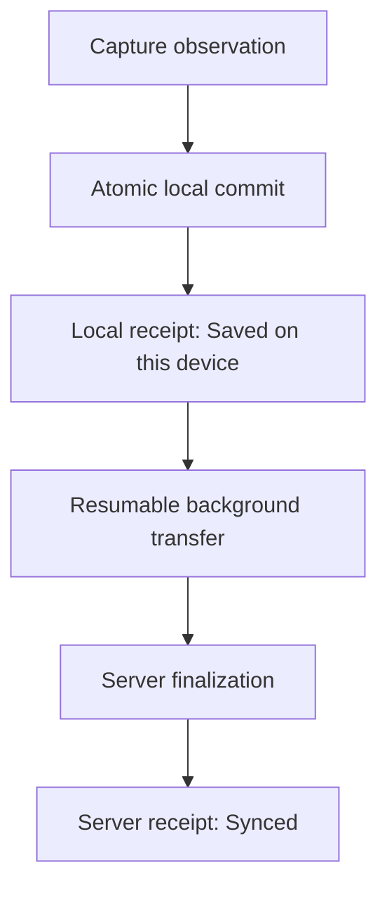

# collect


**Offline-first field data collection for research and operational fieldwork.**

`collect` is a mobile-first progressive web application (PWA) for structured observations, media, and location data. It works reliably when network connectivity is intermittent or unavailable. It pairs a simple contributor interface with a durable local ledger, resumable synchronization, immutable schema versions, and portable research exports.

The core contract is explicit:

- **Saved on this device** means the client committed the observation, media, and outbox operations to IndexedDB.
- **Synced** means the server finalized the complete observation and issued a durable receipt.
- The client never removes a pending observation before the server receipt exists.

---

## Why collect is different

| Requirement                   | `collect` approach                                                                                                                 |
| :---------------------------- | :--------------------------------------------------------------------------------------------------------------------------------- |
| **Work without connectivity** | Collection, drafts, media, and the outbox remain available offline. Connectivity affects transfer timing, not data capture.        |
| **Trustworthy status**        | Local and server receipts represent distinct verifiable facts. The interface uses distinct language for each state.                |
| **Survive interruptions**     | Stable identifiers, durable outbox queues, resumable media uploads, and idempotent endpoints support reliable retry after crashes. |
| **Preserve interpretation**   | Every observation links to an immutable schema version. Finalized evidence cannot be rewritten.                                    |
| **Produce reusable data**     | Checkpoints contain canonical JSONL, CSV, GeoJSON, schema history, original media, data dictionaries, and DataCite metadata.       |
| **Auditable quality signals** | Server-validated attention checks and contributor quality summaries are included in exports without altering research data.        |
| **Zero vendor lock-in**       | The Apache-2.0 core is self-hostable. Checkpoint packages remain interpretable without the application.                            |

---

## Intended use cases

`collect` is built for fieldwork where a lost or ambiguous record is far more costly than a delayed upload.

| Use case                                    | Key capabilities                                                                                                     |
| :------------------------------------------ | :------------------------------------------------------------------------------------------------------------------- |
| **Ecological and environmental monitoring** | Offline transects, automatic location provenance, photo/audio capture, immutable protocols, repository-ready exports |
| **Building and infrastructure surveys**     | Multi-contributor workflows, typed schemas, shared-device account isolation, reproducible checkpoints                |
| **Humanitarian and rapid assessments**      | Hostile network resilience, durable local receipts, recovery exports, explicit sync states                           |
| **Citizen-science research**                | Invite-only access, guided one-field capture, automatic background sync, standardized dataset exports                |
| **Institutional field operations**          | Self-hosted backend, row-level security, private storage buckets, audit logs, administrator readiness views          |

The application does not replace a general-purpose database, spreadsheet editor, or complex survey suite. Its priority is dependable evidence capture with a focused operational surface.

---

## Product flows

### Contributor workflow

1. Open the installed app and sign in.
2. Select an assigned project and tap **Add observation**.
3. Complete one field at a time. Skip optional fields directly without dismissing the keyboard.
4. Tap **Save observation**. The client creates a durable local receipt before displaying success.
5. Continue fieldwork. Synchronization, retries, media transfer, and readiness reports run automatically in the background.
6. Open **Sync** only when a record requires manual attention or a local recovery export is needed.

### Administrator workflow

1. Create a project. Optionally add research context, licenses, and dataset metadata.
2. Define a typed collection schema and preview the live contributor flow.
3. Publish the immutable schema version and invite contributors by email.
4. Monitor multi-device readiness, pending queues, and advisory attention metrics.
5. Export immutable checkpoint archives at any cutoff timestamp, or close the project when all devices report complete.

### iOS container sign-in

Safari and installed iOS web apps use separate storage containers. `collect` bridges this platform boundary:

- Safari authenticates via passwordless magic link by default.
- The installed app authenticates via an eight-character single-use device code.
- A signed-in browser generates the code from **Profile → Sign in another device**.
- Passwords and email OTP codes remain available as fallback options.

---

## Data lifecycle



The synchronization sequence strictly follows: **metadata $\to$ media $\to$ finalization**. Each step is idempotent and resumable. `navigator.onLine` is never used as proof of reachability. Background execution is an optimization, not a dependency for correctness.

---

## Core capabilities

- **Guided capture**: One-field-at-a-time mobile interface with large touch targets, reduced motion support, and software keyboard integration.
- **Typed data fields**: Text, numbers, single/multiple choice, tri-state, dates, coordinates, photos, audio, and repeatable groups.
- **Local persistence**: Automatic draft persistence and atomic IndexedDB local submission receipts.
- **Account isolation**: Dedicated IndexedDB database per account (`collect-local-v1-<userId>`) to protect shared devices.
- **Resumable media uploads**: TUS chunked uploads with client-calculated SHA-256 integrity metadata.
- **Data immutability**: Database triggers protect published schemas and finalized submissions from modification.
- **Access control**: Invite-only registration, administrator allow-lists, passwordless links, and single-use device-link codes.
- **Consent enforcement**: Versioned, server-enforced in-app consent required before data ingestion.
- **Provenance tracking**: Automatic recording of device model, OS, browser, battery, connection, timezone, and location accuracy.
- **Attention checks**: Curated attention verification with server-evaluated chance-corrected scoring.
- **Readiness monitoring**: Real-time aggregation of pending submissions and media across all contributor devices.
- **FAIR checkpoints**: Self-contained ZIP packages containing data files, original media, schemas, and DataCite 4.4 metadata.

---

## Architecture at a glance

| Layer              | Technology                     | Primary responsibility                                                                |
| :----------------- | :----------------------------- | :------------------------------------------------------------------------------------ |
| **Client UI**      | React + TypeScript PWA         | Contributor and administrator interfaces, schema rendering, offline shell             |
| **Local Ledger**   | IndexedDB (`collect-local-v1`) | Drafts, submissions, media blobs, outbox operations, receipts, device state           |
| **Sync Engine**    | TypeScript + TUS client        | Health probes, multi-tab leases, retry loops, upload workers, receipt validation      |
| **Database**       | Supabase PostgreSQL            | Organizations, projects, immutable schemas, submissions, consent, audit logs          |
| **Storage**        | Supabase Storage               | Private media objects (`collect-media`) and checkpoint archives (`collect-exports`)   |
| **Privileged API** | Supabase Edge Functions        | Ingestion, authorization, device linking, invitations, reminders, checkpoint creation |

Read [Architecture](docs/architecture.md) for technical invariants and trust boundaries, and [Product specification](docs/spec.md) for normative requirements.

---

## Quickstart: run locally

### Prerequisites

- Node.js 22+ and npm
- Deno 2 (for Edge Function verification and formatting)

```bash
npm ci
npm run dev
```

Without backend environment variables, `collect` launches an interactive local preview.

Run the verification suite before committing changes:

```bash
npm run check
git diff --check
```

`npm run check` verifies Prettier formatting, validates Markdown doc links, runs the Vitest suite (including axe-core accessibility tests), typechecks TypeScript (`tsc -b`), and builds the production bundle.

---

## Deployment

Deploy `collect` to a dedicated Supabase project and a static host (such as Vercel). Configuration is managed through environment variables:

```bash
export SUPABASE_ACCESS_TOKEN=...
export SUPABASE_PROJECT_REF=...
export APP_URL=https://your-collect.example.org
export BOOTSTRAP_ADMIN_EMAIL=admin@example.org
export VITE_SUPABASE_PUBLISHABLE_KEY=...

npm run provision -- --issue-magic-link
```

Never expose service-role keys or database passwords in client environment variables (`VITE_*`). Read [Deployment](docs/deployment.md) for detailed instructions.

---

## Documentation index

Start with the [documentation index](docs/README.md). Core guides include:

| Document                                               | Purpose                                                               |
| :----------------------------------------------------- | :-------------------------------------------------------------------- |
| [Product value](docs/value.md)                         | Fit, differentiators, and operational return on investment            |
| [User and system flows](docs/flows.md)                 | Step-by-step contributor, admin, and authentication workflows         |
| [Privacy and data handling](docs/privacy.md)           | Data categories, retention rules, and operator responsibilities       |
| [Architecture](docs/architecture.md)                   | System boundaries, storage isolation, and synchronization invariants  |
| [Interface baseline](docs/design.md)                   | Design principles, typography, touch targets, and accessibility rules |
| [Deployment](docs/deployment.md)                       | Setup instructions, environment variables, and CLI automation         |
| [Checkpoint format](docs/export-format.md)             | Archive layout, JSONL/CSV formats, and integrity hashes               |
| [FAIR dataset standards](docs/dataset-standards.md)    | DataCite metadata, data dictionaries, and ontology mapping            |
| [Attention verification](docs/attention-qa.md)         | Quality check bank, scoring formulas, and ethical boundaries          |
| [Background automation](docs/background-automation.md) | Lifecycle hooks, sync triggers, and lease coordination                |
| [Product specification](docs/spec.md)                  | Normative functional and technical requirements                       |
| [Implementation status](docs/PLAN.md)                  | Current test coverage and roadmap status                              |

---

## Project principles

1. **Preserve fieldwork first**: Never discard local data before an explicit server finalization receipt exists.
2. **State only verifiable facts**: Distinguish local receipts from server receipts across all UI copy.
3. **Keep the collection path clean**: Capture exact contributor observations without AI modification.
4. **Enforce explicit decisions**: Require conscious human action for consent, schema publication, and exports.
5. **Protect historical evidence**: Keep published schemas and finalized submissions immutable.
6. **Ensure portability**: Checkpoint exports must remain fully readable and useful without the application.

---

## Contributing

Read [CONTRIBUTING.md](CONTRIBUTING.md) and `AGENTS.md` before making changes. Changes to persistence, synchronization, authorization, schema versioning, or exports must include failure-oriented tests and pass `npm run check`.

---

## License

`collect` is open-source software licensed under the [Apache License 2.0](LICENSE). Copyright © 2026 Gabriele Pizzi.
