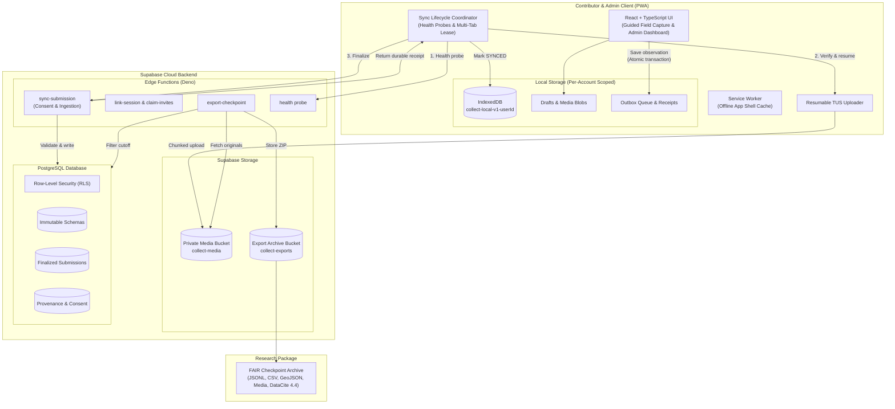

# collect


**Trustworthy field evidence. Offline on any phone.**

`collect` is an offline-first field data collection web app (PWA) for
research and fieldwork. Contributors record structured observations, photos,
audio, and GPS coordinates on phones that may be outside cellular coverage.
Administrators define typed collection schemas, manage contributors, and
export the results as verifiable research packages. The client is built with
React and TypeScript. It stores data locally in IndexedDB and uses a Supabase
backend (PostgreSQL, storage, and Edge Functions). The project is licensed
under Apache-2.0.

## Why it exists

Field surveys must keep working without connectivity, and the data they
produce must stay credible afterwards. `collect` makes two states explicit
and verifiable:

- **Saved on this device** means the observation, its media blobs, and
  outbox operations have committed to the local IndexedDB ledger. This never
  depends on the network.
- **Synced** means the server has finalized the complete observation and
  issued a durable receipt. Only that receipt moves a local record to
  `SYNCED`.

The client never discards pending observations, media originals, drafts, or
outbox queues before such a receipt exists. The synchronization sequence is
strictly metadata → media → finalization; each step is idempotent and resumable.

## Features

- **Guided mobile capture** — one field per step, large touch targets,
  keyboard-aware actions, reduced-motion and contrast support.
- **Typed fields** — text, numbers with units, single/multiple choice,
  tri-state, dates, GPS coordinates, photo, audio, and repeatable groups.
- **Offline-first persistence** — drafts, submissions, media, and an outbox
  queue in IndexedDB, scoped per account (`collect-local-v1-<userId>`).
- **Resumable synchronization** — health-probe gating, multi-tab lease,
  TUS chunked media uploads with SHA-256 checksums, exponential backoff.
- **Immutable evidence** — published schema versions and finalized submissions
  cannot be modified; conflicts are explicit, never silently overwritten.
- **Provider-first sign-in** — Continue with Google or Apple, with email
  links, passwords, and 8-character single-use codes (admin-issued or
  self-service) as backups. Email stays the identifier. Projects appear only
  where a membership exists, and administrator rights only for an
  allow-listed address. See [Authentication](docs/authentication.md).
- **Server-enforced consent** — the backend rejects submissions from accounts
  without an active, unrevoked consent record.
- **Attention verification** — instruction checks evaluated in memory; the
  question and answer never enter the payload or database, only a stable check
  key and an advisory reliability score.
- **Readiness monitoring** — administrators see per-device pending counts and
  sync status across the fleet.
- **FAIR checkpoint exports** — self-contained ZIP archives with canonical
  JSONL, CSV, RFC 7946 GeoJSON, DataCite 4.4 metadata, schema history, data
  dictionaries, and original media with SHA-256 hashes.

## Architecture



| Layer              | Technology                              | Primary responsibility                                                                |
| :----------------- | :-------------------------------------- | :------------------------------------------------------------------------------------ |
| **Client UI**      | React 19 + TypeScript + Vite PWA        | Contributor and administrator interfaces, schema rendering, offline shell             |
| **Local Ledger**   | IndexedDB (`collect-local-v1-<userId>`) | Drafts, submissions, media blobs, outbox operations, receipts, device state           |
| **Sync Engine**    | TypeScript + TUS client                 | Health probes, multi-tab leases, retry loops, upload workers, receipt validation      |
| **Database**       | Supabase PostgreSQL + RLS               | Organizations, projects, immutable schemas, submissions, consent, audit logs          |
| **Storage**        | Supabase Storage (Private)              | Private media objects (`collect-media`) and checkpoint archives (`collect-exports`)   |
| **Privileged API** | Supabase Edge Functions (Deno)          | Ingestion, authorization, device linking, invitations, reminders, checkpoint creation |

## Repository layout

```text
src/                    React PWA — contributor and administrator surfaces
src/lib/                local ledger, sync adapter, admin adapter, protocol
supabase/migrations/    canonical Postgres/RLS/storage schema (immutable history)
supabase/functions/     Edge Functions: ingestion, finalization, invites, export
scripts/                provisioning and build helpers
docs/                   architecture, design, export format, deployment guides
tests/                  Vitest suites (local ledger invariants, sync protocol)
```

## Getting started

### Prerequisites

- Node.js 22+ and npm
- Deno 2 (for Edge Function typechecking and formatting)

```bash
npm ci
npm run dev
```

Without backend environment variables the app opens a clearly labeled local
interface preview. The marketing homepage (`index.html`) is the root Vite
entry in the same bundle; it mounts the app's real components, so interface
changes mirror into its live demo.

### Verification

```bash
npm run check
git diff --check
```

`npm run check` runs formatting checks, validates Markdown documentation
links, runs the Vitest test suite (including axe-core accessibility tests),
typechecks TypeScript (`tsc -b`), and builds the production bundle. Edge
Functions are checked separately with `deno check supabase/functions/**/*.ts`.

## Deployment

You can deploy `collect` against any Supabase project and any static host
(such as Vercel). There is no dependency on a hosted account. The script
`npm run provision` configures Auth, applies the ordered migrations, deploys
every Edge Function, and can request the first administrator's sign-in link:

```bash
export SUPABASE_ACCESS_TOKEN=...          # Supabase Management API / CLI token
export SUPABASE_PROJECT_REF=...           # Supabase project ref
export APP_URL=https://your-collect.example.org
export BOOTSTRAP_ADMIN_EMAIL=admin@example.org
export VITE_SUPABASE_PUBLISHABLE_KEY=sb_publishable_...

npm run provision -- --issue-magic-link
```

Service-role keys and database passwords never enter the client bundle.
Every privileged operation runs inside an Edge Function. The frontend deploys
automatically through the Vercel Git integration on every push to `main`;
migrations and Edge Functions are applied through the Supabase MCP or CLI
(`npm run provision`). See [docs/deployment.md](docs/deployment.md) for the
full guide.

## Documentation

Start with the [documentation index](docs/README.md). Core guides:

| Document                                               | Purpose                                                                 |
| :----------------------------------------------------- | :---------------------------------------------------------------------- |
| [Architecture](docs/architecture.md)                   | System boundaries, storage isolation, and synchronization invariants    |
| [Authentication](docs/authentication.md)               | Provider sign-in, backup methods, invitations, administrator allow-list |
| [Product specification](docs/spec.md)                  | Normative functional and technical requirements                         |
| [Flows](docs/flows.md)                                 | Step-by-step contributor, administrator, and authentication workflows   |
| [Privacy](docs/privacy.md)                             | Data categories, retention rules, and operator responsibilities         |
| [Design](docs/design.md)                               | Interface baseline, typography, touch targets, accessibility rules      |
| [Deployment](docs/deployment.md)                       | Setup instructions, environment variables, and CLI automation           |
| [Export format](docs/export-format.md)                 | Checkpoint archive layout, JSONL/CSV formats, and integrity hashes      |
| [Dataset standards](docs/dataset-standards.md)         | DataCite metadata, data dictionaries, and ontology mapping              |
| [Attention QA](docs/attention-qa.md)                   | Quality check bank, scoring formulas, and ethical boundaries            |
| [Background automation](docs/background-automation.md) | Lifecycle hooks, sync triggers, and lease coordination                  |
| [Implementation status](docs/PLAN.md)                  | Current test coverage and roadmap status                                |

## Contributing

Read [CONTRIBUTING.md](CONTRIBUTING.md) and `AGENTS.md` before making changes.
Changes to persistence, synchronization, authorization, schema versioning, or
exports must include failure-oriented tests and pass `npm run check`.

## License

`collect` is open-source software licensed under the
[Apache License 2.0](LICENSE). Copyright © 2026 Gabriele Pizzi.
