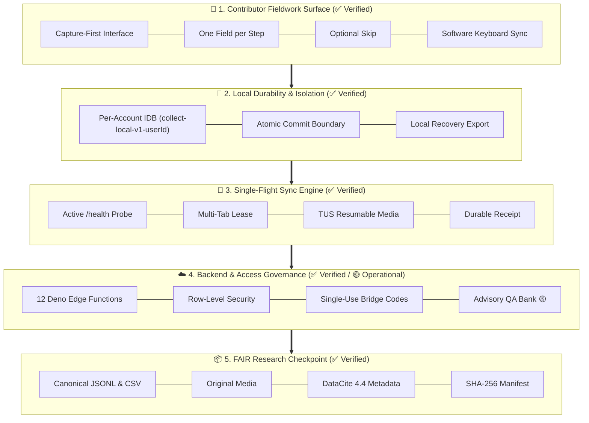

# Implementation status

This document records current product coverage and known limitations. It is not the requirements source of truth; see the [product specification](spec.md).

Last reviewed: 2026-08-14.

## Status legend

| Symbol | Meaning                                                                        |
| ------ | ------------------------------------------------------------------------------ |
| ✅     | Implemented and covered by current verification                                |
| 🟡     | Implemented with a documented limitation or remaining operational verification |
| ⬜     | Planned or intentionally deferred                                              |

## Product coverage

| Area                      | Status | Current implementation                                                                                                                               |
| ------------------------- | ------ | ---------------------------------------------------------------------------------------------------------------------------------------------------- |
| Mobile contributor flow   | ✅     | Capture-first home, one field per step, optional-field Skip, keyboard-aware actions, local receipt                                                   |
| Local durability          | ✅     | Per-account IndexedDB, draft persistence, atomic submission/media/outbox commit, stale-write protection                                              |
| Synchronization           | ✅     | Health-gated metadata → TUS media → finalization, durable receipt, lease, retry, permanent-failure classification                                    |
| Recovery                  | ✅     | Pre-auth recovery path and local unsynced-data package from durable stores                                                                           |
| Project administration    | ✅     | Project creation, typed schema builder, preview, immutable publication, contributor management (roster sign-in-code issuance and access removal)     |
| Multi-user authorization  | ✅     | Organizations, projects, invite-only accounts, row-level security, administrator allow-list                                                          |
| Access revocation         | ✅     | Roster removal revokes membership, pending invites, and readiness rows; research records and device-local observations are preserved                 |
| iOS authentication        | ✅     | Contributor sign-in codes (admin-issued or self-service), administrator magic links, installed-app device codes, password fallback                   |
| Consent                   | ✅     | Versioned interface, contributor profile record, server ingestion enforcement, checkpoint fields                                                     |
| Attention verification    | 🟡     | Server-validated advisory signal and exports; deployment-specific bank validation and localization remain operator duties                            |
| Provenance                | ✅     | Location and environment capture when permitted, schema/app/device/time identity                                                                     |
| Readiness                 | ✅     | Durable counts, automatic completion, multi-device aggregation, administrator polling                                                                |
| Checkpoint export         | ✅     | JSONL, CSV, GeoJSON, original media, schemas, contributor data, manifests, hashes                                                                    |
| FAIR-supporting metadata  | ✅     | DataCite-compatible metadata, data dictionary, dataset README, license/contact/identifier                                                            |
| Accessibility             | 🟡     | Semantic controls, shared modal behavior, reduced motion, contrast modes, Axe coverage; real-device assistive-technology review remains release work |
| Offline application shell | ✅     | Build-time precache manifest and service-worker shell caching                                                                                        |
| Self-hosting              | 🟡     | Automated Supabase/Vercel path documented; every target deployment still requires end-to-end operational verification                                |

## Reliability invariants

These behaviors are complete and must not regress:

1. The interface shows **Saved on this device** only after the local atomic transaction succeeds.
2. The client sets `SYNCED` only after validating a matching server finalization receipt.
3. Submission and media identifiers remain stable across retries and restarts.
4. Published schemas and finalized evidence are immutable through ordinary application paths.
5. Synchronization correctness does not depend on `navigator.onLine` or Background Sync.
6. Unsynced local work remains recoverable.
7. Accounts and iOS containers do not share local databases implicitly.
8. Service-role credentials remain inside Edge Functions.
9. Consent is enforced by the server.
10. Attention data remains separate from the research payload and advisory in interpretation.

## Current limitations

| Limitation                                          | Consequence                                                                                               | Mitigation                                                                                                             |
| --------------------------------------------------- | --------------------------------------------------------------------------------------------------------- | ---------------------------------------------------------------------------------------------------------------------- |
| Browser-managed storage                             | Local data can be lost through device destruction, manual deletion, browser removal, or platform eviction | Persistent-storage request, automatic transfer, quota visibility, recovery export                                      |
| Offline devices are invisible to the server         | A checkpoint cannot prove that no unseen local work exists                                                | Readiness language states only server-visible device status                                                            |
| Email capabilities vary by provider and plan        | Sign-in-code emails or custom templates may not be available                                              | Device-link and password paths; administrators can share issued codes in person; verify Auth and SMTP before fieldwork |
| Attention bank is not universally valid             | Default prompts may be unsuitable for a language or population                                            | Deployment review, translation, replacement, or deactivation                                                           |
| In-app consent is not a full governance system      | Technical enforcement does not satisfy every legal or ethics process                                      | Deployment-specific consent, withdrawal, retention, and review procedures                                              |
| No contributor-side finalized-record editing        | Corrections require a linked successor workflow or administrator process                                  | Preserve original evidence and use `corrects_submission_id` semantics                                                  |
| No guaranteed background execution on every browser | Transfer may wait until the app reopens                                                                   | Durable outbox and lifecycle retry make foreground recovery sufficient                                                 |

## Deferred capabilities

- domain-specific schema packages such as Darwin Core, Ecological Metadata Language, or Data Documentation Initiative;
- repository-specific deposit and DOI-minting integrations;
- audited correction and deletion workflows;
- organization-level policy and retention configuration;
- advanced hosted-service operations, observability, and service-level agreements;
- downstream ontology mapping and model-training workflows;
- non-Supabase backend adapters.

These items must not weaken the core collection path.

## Verification baseline

The current repository baseline includes:

- 21 Vitest files and 126 tests;
- automated Axe checks for representative consent, project setup, profile, and synchronization surfaces;
- client TypeScript checking;
- production Vite build;
- Deno typechecking and formatting for Edge Functions in CI;
- formatting and whitespace checks;
- preview deployment verification.

Before release, also verify:

- browser and installed-iOS authentication;
- offline save, close, reopen, and resume;
- structured and media synchronization;
- matching server receipt behavior;
- administrator multi-device readiness;
- checkpoint generation and package inspection;
- local recovery export;
- accessibility on a physical mobile device.

## Documentation maintenance

Update this page when a planned capability becomes implemented, a limitation changes, or the verification baseline changes. Do not add commit hashes, private project identifiers, production URLs, or one-time deployment observations; those belong in release notes or operational records.
