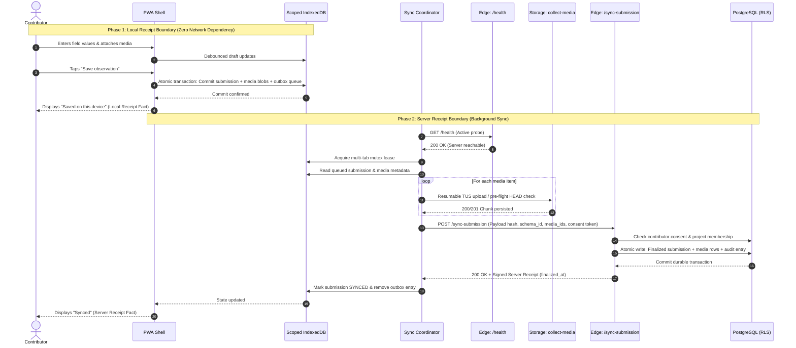
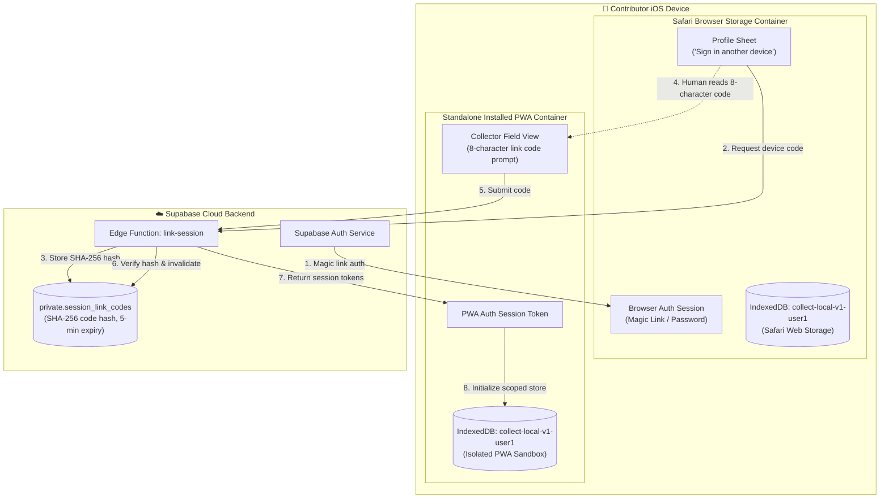
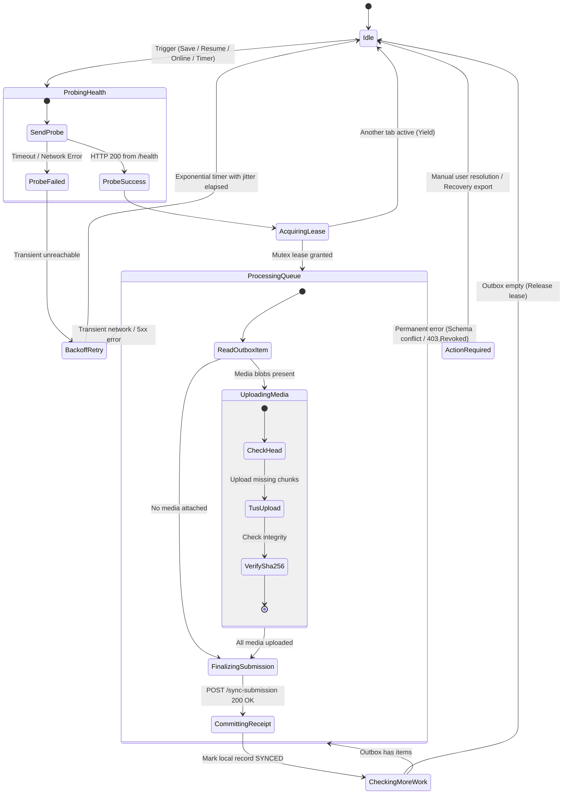

# Architecture

This document describes the system architecture and technical invariants of `collect`. The [product specification](spec.md) defines the normative requirements. This page explains how the implementation enforces those requirements.

---

## System context

`collect` consists of six main layers:

1. **Client PWA**: A React and TypeScript progressive web application with offline caching.
2. **Local ledger**: IndexedDB database scoped to the authenticated account (`collect-local-v1-<userId>`).
3. **Synchronization engine**: Background queue with health probes, leases, retries, and TUS media uploads.
4. **Database**: Supabase PostgreSQL with Row-Level Security (RLS) and immutable record triggers.
5. **Object storage**: Private Supabase Storage buckets for media and checkpoint archives.
6. **Privileged API**: Supabase Edge Functions for ingestion, authorization, invitations, and exports.

```mermaid
flowchart TB
  accTitle: Collect Multi-Layer System Context
  accDescr: Topology showing the Client PWA, scoped local IndexedDB ledger, synchronization engine, Edge Functions, PostgreSQL database with RLS, and private object storage buckets.

  subgraph ClientApp["📱 Client PWA (Offline-First Browser / PWA Shell)"]
    subgraph UIComponents["User Interface & Controllers"]
      Collector["Collector & Guided Form<br/>(One field at a time)"]
      AdminUI["Administrator Dashboard<br/>(Project & Schema Editor)"]
      Controller["useAppController<br/>(Session & State Routing)"]
    end

    subgraph LocalStorage["Local Ledger (Scoped per Account)"]
      IDB[("IndexedDB<br/>collect-local-v1-userId")]
      DraftStore["Drafts & In-Progress Records"]
      Blobs["Media Blobs (Photos / Audio)"]
      OutboxStore["Outbox Operations Queue"]
      ReceiptStore["Local Receipts & State"]
    end

    subgraph SyncCoordinator["Sync Engine & Worker"]
      Lifecycle["Sync Lifecycle Coordinator<br/>(Events, Probes, Timers)"]
      Mutex["Multi-Tab Election Lease"]
      TUSClient["TUS Resumable Upload Client"]
    end
  end

  subgraph SupabaseCloud["☁️ Supabase Managed Cloud Infrastructure"]
    subgraph EdgeLayer["Edge Functions (Deno / TypeScript)"]
      HealthEndpoint["/health<br/>(Reachability probe)"]
      IngestEndpoint["/sync-submission<br/>(Ingestion & Verification)"]
      LinkEndpoint["/link-session<br/>(iOS PWA code auth)"]
      SigninEndpoint["/contributor-signin-code<br/>(Admin-minted & self-service codes)"]
      InviteEndpoint["/claim-invites & send-project-invite"]
      RemovalEndpoint["/remove-project-contributor<br/>(Roster revocation)"]
      ExportEndpoint["/export-checkpoint<br/>(FAIR ZIP bundler)"]
    end

    subgraph StorageLayer["Supabase Storage (S3-Compatible)"]
      MediaBucket[("collect-media<br/>(Private, Path: projects/id/submissions/id/media_id)")]
      ExportsBucket[("collect-exports<br/>(Private, Immutable Checkpoint Archives)")]
    end

    subgraph DatabaseLayer["PostgreSQL Database with Row-Level Security"]
      RLSPolicies["Row-Level Security Policies"]
      SchemaTable[("project_schemas<br/>(Published versions immutable)")]
      SubmissionsTable[("submissions<br/>(Finalized records immutable)")]
      MediaTable[("submission_media<br/>(Metadata & checksums)")]
      ConsentTable[("contributor_profiles & consent_versions<br/>(Versioned legal records)")]
      AuditTable[("audit_events<br/>(Append-only log)")]
    end
  end

  Collector --> DraftStore
  Collector -->|"Save observation (atomic commit)"| IDB
  AdminUI -->|"Manage schemas & projects"| EdgeLayer
  Lifecycle -->|"1. Probe reachability"| HealthEndpoint
  Lifecycle -->|"2. Acquire lease"| Mutex
  Mutex -->|"3. Read pending tasks"| OutboxStore
  Lifecycle -->|"4. Stream media chunks"| TUSClient
  TUSClient -->|"TUS protocol"| MediaBucket
  Lifecycle -->|"5. Finalize payload"| IngestEndpoint
  IngestEndpoint -->|"Verify consent & hashes"| RLSPolicies
  RLSPolicies --> SubmissionsTable
  RLSPolicies --> MediaTable
  RLSPolicies --> AuditTable
  IngestEndpoint -->|"Return final receipt"| Lifecycle
  Lifecycle -->|"Mark SYNCED"| ReceiptStore
  ExportEndpoint -->|"Filter cutoff"| SubmissionsTable
  ExportEndpoint -->|"Fetch originals"| MediaBucket
  ExportEndpoint -->|"Write archive ZIP"| ExportsBucket
```



---

## Client code boundaries

| Path                          | Responsibility                                                                                                          |
| :---------------------------- | :---------------------------------------------------------------------------------------------------------------------- |
| `src/App.tsx`                 | Root shell, surface routing, and code-split chunk loading                                                               |
| `src/app/useAppController.ts` | Session lifecycle, active project selection, and state orchestration                                                    |
| `src/app/submission.ts`       | Local validation and atomic commit transaction boundary                                                                 |
| `src/app/syncController.ts`   | Queue execution, upload workers, and item failure isolation                                                             |
| `src/app/useSyncLifecycle.ts` | Lifecycle event listeners and single-flight sync coordination                                                           |
| `src/app/recovery.ts`         | Local ZIP package builder for unsynced device data                                                                      |
| `src/components/`             | Contributor and administrator feature views                                                                             |
| `src/components/ui/`          | Shared accessible UI controls, dialogs, and sheets                                                                      |
| `src/lib/localDatabase.ts`    | IndexedDB transaction wrappers and database initialization                                                              |
| `src/lib/localStore.ts`       | Domain operations, media blob storage, outbox, and migrations                                                           |
| `src/lib/syncProtocol.ts`     | Shared synchronization types and protocol definitions                                                                   |
| `src/styles/`                 | Foundation CSS tokens, geometry layers, and mobile viewport styling                                                     |
| `src/homepage/`               | Marketing homepage (`homepage.html`), a second Vite entry that mounts the app's real components and links to these docs |

Feature components never query IndexedDB directly or invoke privileged server endpoints without an adapter. Contributor views do not download administrator code chunks.

---

## Receipt boundaries

The core architecture strictly separates local storage guarantees from server finalization guarantees.



### 1. Local receipt boundary

```text
Edit field
  → Debounced draft write to IndexedDB
Tap Save observation
  → Validate required schema fields
  → Commit submission + media + outbox atomically
  → Display "Saved on this device"
```

The client displays the local receipt only after the IndexedDB transaction completes. Network failures cannot invalidate a local receipt.

### 2. Server receipt boundary

```text
Health probe succeeds
  → Send submission metadata
  → Upload or verify media items via TUS
  → Invoke server finalization
  → Validate matching server receipt
  → Mark local submission SYNCED
```

A request start, upload progress, or optimistic UI state is never treated as a server receipt.

---

## Local ledger rules

The local IndexedDB ledger stores drafts, submissions, media blobs, outbox entries, receipts, and device metadata:

- **Pre-generated identifiers**: Submission and media UUIDs are generated before network requests.
- **Draft isolation**: Drafts remain outside the outbox and never upload. Discarding a draft deletes its unsubmitted media blobs.
- **Single storage location**: Media blobs live in one durable store and are referenced by ID rather than copied across records.
- **Write safety**: Stale draft autosaves cannot overwrite submitted media or revert a `SYNCED` record.
- **Resilient recovery**: The recovery exporter reads stores directly and skips unreadable blobs without crashing.
- **Safe migrations**: Schema upgrades snapshot source data before applying changes in a write transaction.

---

## Storage isolation per account and container

1. **Account isolation**: Each user account uses its own database (`collect-local-v1-<userId>`). Switching accounts on a shared device isolates drafts, submissions, and outbox queues.
2. **iOS container separation**: Safari and installed Home Screen web apps run in separate storage containers. They do not share cookies, sessions, IndexedDB, or service worker caches.
3. **Cross-container linking**: A signed-in browser generates a short-lived device code to authenticate the installed app without copying local data.



---

## Synchronization engine

### Triggers

Synchronization triggers run through a single-flight coordinator:

- Observation saved locally.
- App startup or foreground resume.
- Browser `online` event.
- Due-work scheduler timer.
- Stale-lease recovery.
- Manual retry action in the UI.

### Concurrency and lease control

- **Reachability checks**: The client probes the `/health` endpoint before transferring data. It never treats `navigator.onLine` as proof of server availability.
- **Multi-tab lease**: A cross-tab mutex ensures only one tab processes the outbox at a time.
- **Crash recovery**: Incomplete `IN_PROGRESS` tasks return to the queue if a lease expires.
- **Item isolation**: A failure in one submission does not block other queued submissions.



### Error classification

- **Transient errors** (network drops, 5xx responses): Retried automatically using exponential backoff with jitter.
- **Permanent errors** (schema mismatch, revoked access, closed project): Marked `ACTION_REQUIRED` and halted until user action.

### Ingestion idempotency

Re-submitting an existing submission ID succeeds only when the project, contributor, schema, payload hash, and media list match the original record. The server updates atomically and returns the existing finalization receipt.

---

## Evidence immutability and schema history

- **Immutable schemas**: Published schema versions cannot be modified. Form edits create a new schema version without altering historical observations.
- **Immutable submissions**: Finalized submissions cannot be updated or deleted through the client API.
- **Deterministic media paths**: Media files follow a predictable hierarchy in Supabase Storage:
  ```text
  projects/{project_id}/submissions/{submission_id}/{media_id}
  ```

---

## Security and authorization

- **Row-Level Security**: Enabled across all public tables. Access rules evaluate `organization_members` and `project_members`.
- **Privileged functions**: Supabase Edge Functions verify caller authentication and perform server-side permission checks.
- **Private keys**: Service-role keys exist only in Edge Function secrets.
- **Secure views**: `project_overviews` uses `security_invoker = true` to preserve user RLS policies.
- **Bridge codes**: contributor sign-in and device-link codes share one
  single-use bridge table (`private.session_link_codes`): 8 characters from
  an unambiguous alphabet, stored only as SHA-256 hashes, atomic consume,
  and short TTLs. Code guessing is rate-limited per source IP.
- **Mint throttles**: self-service sign-in-code requests are throttled per
  user (3 per 20 minutes) and per IP (20 per hour); administrator minting is
  authenticated and written to `audit_events`.
- **Identity resolution**: Edge Functions resolve emails through the
  security-definer RPC `resolve_user_id_by_email`; the `auth` schema is
  never queried through PostgREST.
- **Access revocation**: `remove-project-contributor` revokes the
  membership, pending invites, and device-readiness rows. Submissions,
  media, attention responses, and the contributor profile stay in the
  dataset; the contributor's device keeps local observations and shows a
  distinct **Project access removed** state.

---

## Related documentation

- [User and system flows](flows.md)
- [Privacy and data handling](privacy.md)
- [Background automation](background-automation.md)
- [Deployment](deployment.md)
- [Product specification](spec.md)
