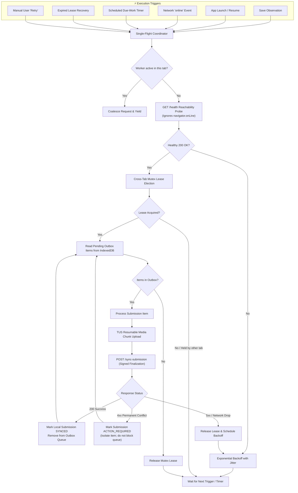
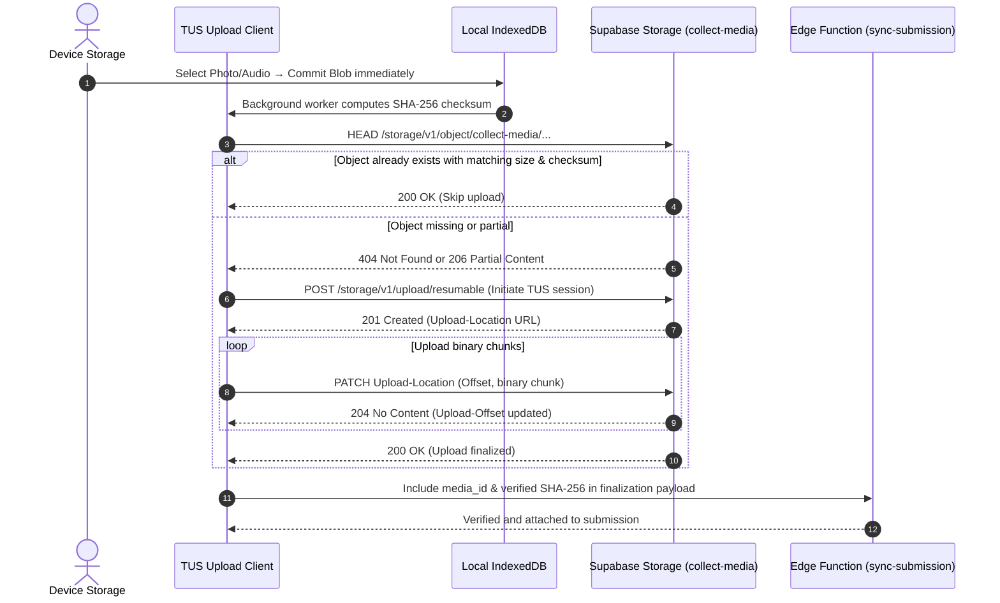

# Background automation

`collect` automates routine tasks that do not require human decisions. Automation improves fieldwork efficiency without compromising data safety.

---

## Automation map

| Area                    | Automatic behavior                                                   | User notice                                                       |
| :---------------------- | :------------------------------------------------------------------- | :---------------------------------------------------------------- |
| **Draft saving**        | Debounced IndexedDB persistence; flushes on page hide or tab switch. | Notice appears only if local storage fails.                       |
| **Media storage**       | Immediate blob persistence and background SHA-256 calculation.       | Notice appears only if media blob is corrupt or missing.          |
| **Location capture**    | Coordinates captured on collector open and refreshed on save.        | Prompts if permission is missing for required fields.             |
| **Synchronization**     | Health probe, lease election, TUS upload, and atomic finalization.   | Active only in background; surfaces errors when action is needed. |
| **Readiness reporting** | Background device pings with pending submission counts.              | Visible on the administrator monitoring dashboard.                |
| **PWA caching**         | Precache manifest caches app shell for instant offline loading.      | Silent; updates automatically on new version releases.            |
| **Recovery packaging**  | Directly streams IndexedDB records into a local ZIP file.            | Triggered manually when exporting unsynced local data.            |

---

## Local persistence rules

- **Debounced writes**: Draft changes persist after a short debounce and flush on `visibilitychange` or `pagehide`.
- **Immediate media commits**: Selected photos and audio persist directly to IndexedDB without waiting for form submission.
- **Reference integrity**: Draft metadata references media blobs by ID to prevent duplicate storage.
- **Write safety**: Stale autosave callbacks cannot overwrite finalized submissions or downgrade `SYNCED` records.
- **Account isolation**: Each user account uses an isolated database (`collect-local-v1-<userId>`).

---

## Synchronization lifecycle

The single-flight synchronization manager triggers on:

1. Saving an observation.
2. Launching or focusing the application.
3. Browser `online` network event.
4. Scheduled background timer.
5. Mutex lease expiration / recovery.
6. Manual tap on **Retry**.

### Coordination and safeguards

- **Reachability check**: Probes the `/health` endpoint with a timeout; ignores `navigator.onLine`.
- **Single-flight mutex**: Cross-tab lease ensures only one active upload worker runs at a time.
- **Exponential backoff**: Transient network errors retry automatically with randomized jitter.
- **Permanent failure isolation**: Schema conflicts or missing media become `ACTION_REQUIRED` and do not block unrelated records.

---

## Resumable media transfer

- The client queries the server to check if an object already exists before uploading.
- TUS protocol resumes partial uploads using deterministic upload URLs.
- Concurrency limits prevent network saturation on low-bandwidth connections.
- Upload progress tracks per media item.
- Server validates file size and checksums before completing finalization.
- Original media files are never recompressed.

---

## Manual human actions

These consequential actions always require deliberate human input:

| Action                        | Reason                                      |
| :---------------------------- | :------------------------------------------ |
| **Save observation**          | Creates the durable local evidence receipt. |
| **Grant or revoke consent**   | Legal and ethical privacy decision.         |
| **Publish schema version**    | Creates an immutable data contract.         |
| **Invite team member**        | Grants project access and triggers emails.  |
| **Close or archive project**  | Halts new fieldwork collection.             |
| **Export checkpoint archive** | Generates an external research snapshot.    |

---

## Related documentation

- [User and system flows](flows.md)
- [Architecture](architecture.md)
- [Privacy and data handling](privacy.md)
- [Attention verification](attention-qa.md)
