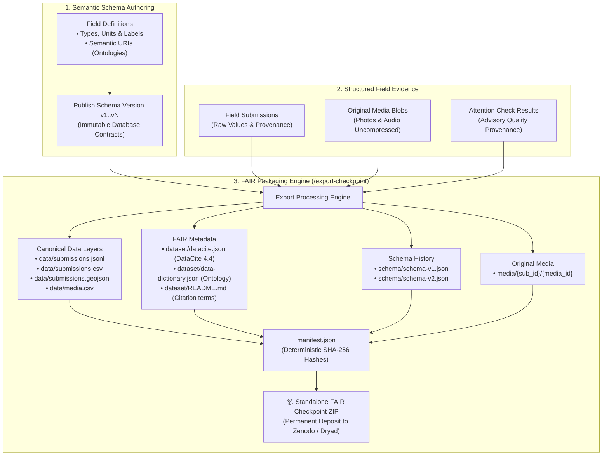

# FAIR dataset standards

Every `collect` checkpoint export is a self-contained research archive. The archive includes DataCite-compatible metadata, machine-readable data dictionaries, and human-readable documentation to support the FAIR data principles (Findable, Accessible, Interoperable, Reusable).

---

## 1. FAIR principles in collect



| Principle             | Implementation in `collect`                                                                                      | Package location                                                  |
| :-------------------- | :--------------------------------------------------------------------------------------------------------------- | :---------------------------------------------------------------- |
| **F — Findable**      | DataCite 4.4 kernel metadata, persistent project identifiers, human-readable README.                             | `dataset/datacite.json`, `dataset/README.md`, `manifest.json`     |
| **A — Accessible**    | Self-contained ZIP archive with zero external network dependencies.                                              | Complete ZIP package                                              |
| **I — Interoperable** | Canonical JSONL, CSV, GeoJSON, immutable schema history, and data dictionary with `semantic_uri` ontology hooks. | `data/*`, `schema/*`, `dataset/data-dictionary.json`              |
| **R — Reusable**      | Embedded SPDX licenses, data contact emails, schema version references, and consent audit logs.                  | `manifest.json`, `dataset/datacite.json`, `data/contributors.csv` |

---

## 2. Project metadata fields

Administrators configure dataset metadata during project setup under **Workspace and dataset metadata**:

| Field                  | Database column               | Example                  | Purpose                                                   |
| :--------------------- | :---------------------------- | :----------------------- | :-------------------------------------------------------- |
| **License**            | `projects.license`            | `CC-BY-4.0`              | SPDX license identifier for machine-readable reuse terms. |
| **Dataset contact**    | `projects.contact_email`      | `dataset@lab.org`        | Contact email for inquiries and data corrections.         |
| **Dataset identifier** | `projects.dataset_identifier` | `10.5281/zenodo.0000000` | Persistent DOI or landing-page URL.                       |

Supported license presets: `CC0-1.0`, `CC-BY-4.0`, `CC-BY-SA-4.0`, `ODbL-1.0`, `Proprietary`, or custom text.

---

## 3. Metadata files in checkpoints

### 3.1 `dataset/datacite.json`

DataCite 4.4 kernel metadata formatted for repository deposit (Zenodo, Figshare, Dryad):

```json
{
  "schemaVersion": "http://datacite.org/schema/kernel-4.4",
  "identifier": {
    "identifier": "10.5281/zenodo.0000000",
    "identifierType": "DOI"
  },
  "creators": [{ "name": "Field Research Lab", "nameType": "Organizational" }],
  "titles": [{ "title": "Valladolid Rural Houses — checkpoint dataset" }],
  "publisher": "Field Research Lab",
  "publicationYear": "2026",
  "resourceType": { "resourceTypeGeneral": "Dataset" },
  "version": "checkpoint-uuid",
  "descriptions": [
    {
      "description": "Occupancy and condition survey",
      "descriptionType": "Abstract"
    }
  ],
  "license": "CC-BY-4.0",
  "contributors": [
    {
      "name": "Dataset Contact",
      "contributorType": "ContactPerson",
      "nameType": "Organizational",
      "contactEmail": "dataset@lab.org"
    }
  ],
  "dates": [{ "date": "2026-08-12T00:00:00Z", "dateType": "Created" }],
  "subjects": [
    { "subject": "Rural Architecture" },
    { "subject": "Field Survey" }
  ],
  "alternateIdentifiers": [
    {
      "alternateIdentifier": "project-uuid",
      "alternateIdentifierType": "collect-project"
    }
  ]
}
```

### 3.2 `dataset/data-dictionary.json`

Lists every field across all published schema versions:

```json
[
  {
    "schema_version": 1,
    "key": "building_type",
    "label": "Building type",
    "type": "single_choice",
    "required": true,
    "description": null,
    "semantic_uri": "https://example.org/ontology#BuildingType",
    "unit": null,
    "options": [
      { "id": "building-house", "value": "house", "label": "House" },
      { "id": "building-other", "value": "other", "label": "Other" }
    ]
  }
]
```

### 3.3 `dataset/README.md`

Human-readable markdown file containing project description, license terms, contact email, and cutoff timestamp.

---

## 4. Practical usage

1. **DOI Registration**: Use `dataset/datacite.json` directly when publishing datasets to Zenodo, Dryad, or institutional repositories.
2. **External Analysis**: Analysts use `dataset/data-dictionary.json` to understand column types and ontology mappings without inspecting the application codebase.
3. **Data Audits**: Checksum values in `manifest.json` verify that CSV and JSONL files match their state at cutoff.

---

## Related documentation

- [Checkpoint export format](export-format.md)
- [Attention verification](attention-qa.md)
- [Privacy and data handling](privacy.md)
- [Architecture](architecture.md)
