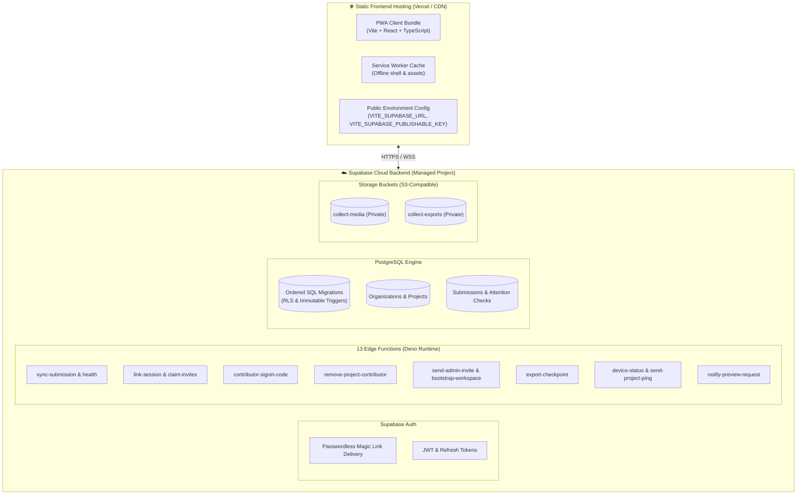

# Deployment

This guide explains how to deploy `collect` to Supabase (backend) and Vercel (frontend).

---

## Deployment model



| Component              | Provider                  | Purpose                                                                                                      |
| :--------------------- | :------------------------ | :----------------------------------------------------------------------------------------------------------- |
| **Frontend**           | Vercel or static CDN host | Hosts the PWA client bundle and service worker.                                                              |
| **Database**           | Supabase PostgreSQL       | Stores organizations, schemas, submissions, consent, and audit logs.                                         |
| **Object storage**     | Supabase Storage          | Hosts private media (`collect-media`) and checkpoint ZIPs (`collect-exports`).                               |
| **Privileged API**     | Supabase Edge Functions   | Handles ingestion, invitations, device linking, and exports.                                                 |
| **Identity providers** | Google, Apple             | Admit people without email. Enabled per deployment; the sign-in screen offers only what is enabled.          |
| **Email delivery**     | Resend / Supabase Auth    | Resend sends invitations, sign-in codes, and reminders. The provider mailer only sends backup sign-in links. |

> [!WARNING]
> Never put service-role keys or database passwords into frontend environment variables (`VITE_*`).

---

## Prerequisites

- Node.js 22+ and npm
- Deno 2 (for Edge Functions)
- Supabase CLI installed and logged in (`supabase login`)
- Vercel CLI (optional for manual deploy: `npm i -g vercel`)
- Canonical production HTTPS URL (e.g. `https://collect.example.org`)
- Initial administrator email address

---

## Automated provisioning (one-command setup)

Set the required environment variables:

```bash
export SUPABASE_ACCESS_TOKEN=sbp_...
export SUPABASE_PROJECT_REF=your-project-ref
export APP_URL=https://collect.example.org
export BOOTSTRAP_ADMIN_EMAIL=admin@example.org
export VITE_SUPABASE_PUBLISHABLE_KEY=sbp_...

# Optional: DB password if required by Supabase CLI
export SUPABASE_DB_PASSWORD=...

npm run provision -- --issue-magic-link
```

### What `npm run provision` does:

1. Validates the canonical `APP_URL`.
2. Configures Supabase Auth Site URL and redirect allow-lists.
3. Links the local project directory to the Supabase project.
4. Applies all ordered SQL migrations (`supabase db push`).
5. Sets Edge Function secrets (`APP_URL`, `BOOTSTRAP_ADMIN_EMAIL`).
6. Deploys all 13 Edge Functions listed in `scripts/provision.mjs`.
7. Sends an initial bootstrap authentication link to `BOOTSTRAP_ADMIN_EMAIL`.

---

## Manual provisioning steps

### 1. Apply database migrations

```bash
supabase link --project-ref "$SUPABASE_PROJECT_REF"
supabase db push --linked
```

Always create a new timestamped migration file in `supabase/migrations/` when updating schema or policies. Never edit an already applied migration.

### 2. Deploy Edge Functions

```bash
for fn in \
  health \
  claim-invites \
  device-status \
  link-session \
  contributor-signin-code \
  remove-project-contributor \
  send-admin-invite \
  send-project-invite \
  send-project-ping \
  export-checkpoint \
  sync-submission \
  bootstrap-workspace \
  notify-preview-request
do
  supabase functions deploy "$fn" --project-ref "$SUPABASE_PROJECT_REF" --no-verify-jwt
done
```

### 3. Set Edge Function secrets

```bash
supabase secrets set \
  APP_URL=https://collect.example.org \
  BOOTSTRAP_ADMIN_EMAIL=admin@example.org \
  --project-ref "$SUPABASE_PROJECT_REF"
```

Optional email delivery secrets:

```bash
supabase secrets set \
  RESEND_API_KEY=re_... \
  MAIL_FROM='Collect <fieldwork@example.org>' \
  ALLOWED_EMAIL_PATTERNS='admin@example.org,@org.example.org' \
  --project-ref "$SUPABASE_PROJECT_REF"
```

### 4. Configure the homepage "Request access" email notification

The homepage's `PreviewForm` inserts anonymously into `preview_requests`
(`src/homepage/PreviewForm.tsx`). A database trigger
(`20260815070533_notify_preview_request.sql`) calls the
`notify-preview-request` Edge Function after every accepted insert, which
emails a maintainer inbox through the shared `sendEmail` helper. This needs
`RESEND_API_KEY`/`MAIL_FROM` (above) plus one Edge Function secret and two
Supabase Vault entries, none of which are set by this migration file on
purpose — a self-hosted fork that skips this step gets a silent no-op
instead of a notification e-mailed to the wrong inbox:

```bash
# Edge Function secret: destination inbox and the shared value the trigger
# must present. Pick your own random token for the second one.
supabase secrets set \
  PREVIEW_REQUEST_NOTIFY_TO=you@example.org \
  PREVIEW_REQUEST_WEBHOOK_SECRET='<random-token>' \
  --project-ref "$SUPABASE_PROJECT_REF"
```

```sql
-- Run once against the project database (SQL editor or `execute_sql`).
-- Use the exact same random token as PREVIEW_REQUEST_WEBHOOK_SECRET above.
select vault.create_secret(
  'https://YOUR-PROJECT-REF.supabase.co/functions/v1/notify-preview-request',
  'preview_request_webhook_url'
);
select vault.create_secret('<random-token>', 'preview_request_webhook_secret');
```

---

## Configuring Supabase Auth

Production settings are codified in `supabase/config.toml` (auth section +
`supabase/templates/*.html`); apply them with `supabase config push` once the
project is linked. The production project currently has these applied:

- **Site URL**: `https://collect.gbrlpzz.com` (single deployment: homepage at
  `/`, app at `/app`).
- **Redirect allow-list**: `https://collect.gbrlpzz.com/**` and
  `https://collect-tawny.vercel.app/**`. The deployment answers on both
  addresses, and a sign-in returns to the one the person is actually using —
  a session belongs to the origin that started it.
- **Function origins**: `APP_URL` is the canonical origin; `APP_ALT_ORIGINS`
  lists any other origin that must keep working (comma separated). Functions
  echo the caller's origin when it is on that list, so an app installed from
  the older address keeps syncing.
- **Identity providers**: Google is enabled. Apple is prepared but off until
  its credentials exist.
- **Open contributor sign-up**: `disable_signup = false`. A first Google or
  Apple sign-in is a sign-up, so this must stay open. An account on its own
  shows nothing: projects need a membership, and administrator rights need
  the allow-list. The email link path still refuses to create accounts.
- **Identity providers**: Google and Apple. Credentials are set through
  `npm run provision -- --auth-only` (or the dashboard); the sign-in screen
  reads `/auth/v1/settings` and offers exactly what is enabled. Full setup in
  [Authentication](authentication.md).
- **Bridge codes**: contributor sign-in and device-link codes share one
  bridge table: 8 characters from an unambiguous alphabet (32⁸), single-use
  with an atomic consume, and stored only as SHA-256 hashes. Sign-in codes
  expire after 20 minutes and are throttled (3 per user per 20 minutes on
  self-service; the anonymous request path is additionally capped per IP at
  20 per hour). The exchange path shares the same per-IP budget (20 per
  hour), which is the effective control against code guessing. Device-link
  codes expire after 5 minutes.

The branded email templates (invite, magic link, confirmation, recovery,
email-change, reauthentication) live in `supabase/templates/`. Customizing
them through the Supabase API requires either a paid plan or a custom SMTP
provider; on the free tier with the default mailer, template edits are
rejected (`Email template modification is not available for free tier
projects`). Once a custom SMTP provider (e.g. Resend SMTP) is configured,
run `supabase config push` to publish the templates. Until then, Supabase
sends its default-styled emails.

### Edge Function secrets

`contributor-signin-code` sends codes through the same Resend helper as
`send-project-ping` (`RESEND_API_KEY`, `MAIL_FROM`). Delivery is advisory:
if the secrets are missing the administrator still sees the issued code and
can share it in person.

`notify-preview-request` uses the same Resend helper to email a maintainer
inbox whenever the homepage "Request access" form gets a new submission (see
"Configure the homepage 'Request access' email notification" above). It is
invoked by a database trigger, not by a signed-in user, so it also needs
`PREVIEW_REQUEST_NOTIFY_TO` and `PREVIEW_REQUEST_WEBHOOK_SECRET`.

Optional Edge Function settings:

- `EXPORT_MAX_ARCHIVE_BYTES` — upper bound on the media bytes a checkpoint
  export will pack in memory (default 512 MiB). A project whose media exceeds
  the limit gets an explicit 413 instead of a function crash.

---

## Bootstrapping the initial administrator

1. Open your deployed URL (`https://collect.example.org`).
2. Request a magic link for the configured `BOOTSTRAP_ADMIN_EMAIL`.
3. Click the link in your email to sign in.
4. Set your account password when prompted.
5. Open the administrator console at `https://collect.example.org/?role=admin`.
6. `bootstrap-workspace` creates the organization and grants you owner access. Subsequent users cannot call this endpoint.

---

## Frontend deployment

### Environment variables (`.env.production`)

```dotenv
VITE_SUPABASE_URL=https://YOUR_PROJECT_REF.supabase.co
VITE_SUPABASE_PUBLISHABLE_KEY=...
VITE_APP_URL=https://collect.example.org
VITE_APP_VERSION=0.1.2
VITE_ORGANIZATION_NAME=Your Organization
```

### Build and deploy to Vercel

```bash
npm ci
npm run check
vercel --prod
```

---

## Installing on iOS (iPhone / iPad)

1. Open Safari and navigate to `https://collect.example.org`.
2. Tap the **Share** button in Safari.
3. Select **Add to Home Screen**.
4. Open the installed app icon from your Home Screen.
5. In your desktop or mobile browser, open **Profile → Sign in another device** to get an 8-character code.
6. Enter the code in the installed app to authenticate immediately.

---

## Verification checklist

Verify these 10 items on every deployment:

1. Production URL loads the offline PWA shell.
2. Sign-in works via contributor sign-in code (admin-issued or self-service) and administrator magic link.
3. Installed iOS app links successfully with a device code.
4. Offline observation can be created, saved, closed, and reopened.
5. Structured data and media upload cleanly when online.
6. Local record changes to `SYNCED` only after server receipt arrives.
7. Administrator dashboard reflects updated device readiness.
8. Checkpoint ZIP exports cleanly and passes checksum validation.
9. Local recovery export builds a valid ZIP archive of unsynced data.
10. Application logs do not expose sensitive credentials or personal data.

---

## Related documentation

- [Architecture](architecture.md)
- [User and system flows](flows.md)
- [Privacy and data handling](privacy.md)
- [Contributing](../CONTRIBUTING.md)
