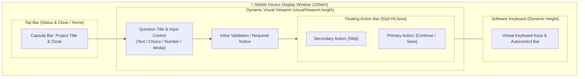

# Interface baseline

`collect` is a mobile-first field application. The user interface prioritizes clarity, legibility in bright sunlight, large touch targets, and strict accessibility.

---

## Design principles

1. **Focused hierarchy**: The primary action is always visually dominant and easy to reach with one hand.
2. **Monochrome contrast**: Contributor views use high-contrast light monochrome; administrator views use dark monochrome.
3. **Generous touch targets**: All interactive elements have at least a $44\times44\text{ pt}$ hit area ($52\text{ pt}$ for primary mobile actions).
4. **Text-based state**: Status is conveyed with clear words and shapes, never by color alone.
5. **Progressive disclosure**: Secondary technical details stay collapsed in expandable disclosure sections.
6. **Calm background systems**: Background sync, telemetry, and health probes stay quiet unless an error requires human action.

---

## Mobile keyboard integration

The software keyboard is part of the mobile viewport, not an obstruction:

- The app tracks viewport resizing using `visualViewport` events.
- Primary action buttons remain positioned above the active keyboard.
- Users can tap **Skip** or **Continue** without dismissing the keyboard.
- Empty optional fields never autofocus or trigger unwanted keyboard popups.

---

## Guided capture flow

The collector presents questions one field at a time:

- **Single-choice & dates**: May advance automatically upon selection.
- **Text, numbers, & media**: Wait for explicit user confirmation (**Continue**).
- **Required fields**: Block advancement until answered, showing an inline explanation.
- **Optional fields**: Display a clear **Skip** button.
- **Pause & Resume**: Tapping **Home** saves the draft in IndexedDB. Users can resume later or discard with confirmation.

---

## Design tokens and color system

| Token                  | Contributor theme       | Administrator theme       |
| :--------------------- | :---------------------- | :------------------------ |
| **Canvas**             | `#f5f5f7` (light gray)  | `#000000` (deep black)    |
| **Paper / Card**       | `#ffffff` (pure white)  | `#1c1c1e` (elevated dark) |
| **Primary Text**       | `#1d1d1f` (near black)  | `#f5f5f7` (near white)    |
| **Secondary Text**     | `#636366`               | `#aeaeb2`                 |
| **Tertiary Text**      | `#707075`               | `#8e8e93`                 |
| **Accent Action**      | `#000000` (solid black) | `#ffffff` (solid white)   |
| **Accent Text**        | `#ffffff` (white)       | `#000000` (black)         |
| **Destructive Action** | Semantic red            | Semantic red              |

---

## Typography and spacing

- **Font family**: System native stack (`-apple-system, BlinkMacSystemFont, "Segoe UI", Roboto, sans-serif`).
- **Scale roles**:
  - Title: $24\text{ pt}$ / Semi-bold
  - Headline: $20\text{ pt}$ / Semi-bold
  - Body: $17\text{ pt}$ / Regular ($1.4$ line height)
  - Subheadline: $15\text{ pt}$ / Regular
  - Footnote / Caption: $13\text{ pt}$ – $12\text{ pt}$
- **Spacing scale**: Strict 4-point grid (`4, 8, 12, 16, 20, 24, 32, 40, 48px`).

### Alignment contract

A screen may use only a few left edges, and each one must be deliberate. Two
edges a few pixels apart read as a defect, not as a hierarchy.

- **Page gutter**: `16px` on a phone. Every page, sheet, and card uses it. A
  border on the container is part of that inset, never added on top of it.
- **Grouped rows**: every row family in one list uses the same gutter. An
  empty state is a row and keeps that gutter too.
- **Disclosures**: a card disclosure (a bordered panel with a leading icon,
  such as the profile sheet rows) opens its text on the summary title column,
  which is `page inset + icon width + row gap`. A full-bleed disclosure (a
  plain row with a separator, such as the sync sheet and the consent screen)
  opens its content on the container gutter. Full-width controls always span
  the container, never the text column.
- **Definition lists**: reset the user-agent `dd` indent. The description
  starts on the same edge as its term.
- **Text controls**: one inner inset per control family, so stacked inputs,
  selects, and choice rows put their text on one column. A control border is
  counted inside that inset.

---

## Sign-in screen

The sign-in screen is the one place where two outside brands appear. It
follows the Apple Human Interface Guidelines verbatim; no deviation record
applies.

- **Sign in with Apple** ([HIG](https://developer.apple.com/design/human-interface-guidelines/sign-in-with-apple)):
  the title is one of Apple's approved strings (_Continue with Apple_); logo
  and title share one colour — black on the light contributor surface, white
  on the dark administrator surface; the button is never smaller than the
  other sign-in buttons and needs no scrolling; the corner radius matches the
  app's own buttons, which the guidelines allow.
- **Managing accounts** ([HIG](https://developer.apple.com/design/human-interface-guidelines/managing-accounts)):
  every action names its method (_Continue with Google_, _Email me a sign-in
  link_, _Sign in with a password_, _Sign in with a code_); only methods the
  deployment actually offers are shown; an account created through a provider
  is never asked to invent a password.
- **Buttons** ([HIG](https://developer.apple.com/design/human-interface-guidelines/buttons)):
  46px control height (above the 44pt minimum hit region), one coherent set
  of equally sized primary choices, a visible press state, and an activity
  indicator inside the button while a request is in flight.
- **Google** uses the unmodified four-colour mark on a white button with a
  `#747775` border (light) or a `#131314` button with a `#8e918f` border
  (dark).

Backup methods are a grouped list under **Other ways to sign in**: a leading
symbol, the method name, and a chevron, following the
["Lists and tables"](https://developer.apple.com/design/human-interface-guidelines/lists-and-tables)
rule that a row which opens a view carries a disclosure indicator. A row
names its method and explains nothing; the explanation appears when that
method opens. Choosing a row opens it alone, with **All sign-in options** to
step back, so no screen presents two ways in at once.

Explanation follows the same rule as everywhere else: rows explain nothing
until opened. The one exception is the installed app on iOS, where a provider
opens in the browser and the two containers keep separate sessions. That is a
situation the person can act on, so it appears as a visible callout with its
remedy — **Sign in with a code** — inside the message, not as a collapsed
note.

---

## Accessibility requirements

1. **Screen readers**: Every button, input, and icon includes explicit accessible labels (`aria-label` or `<label>`).
2. **Keyboard navigation**: Logical tab order across all views; focus traps inside modal sheets and dialogs.
3. **High contrast**: Meets WCAG 2.1 AA ($4.5:1$ text contrast ratio).
4. **Reduced motion**: Respects `prefers-reduced-motion` by disabling transitions and animations.

---

## Related documentation

- [User and system flows](flows.md)
- [Privacy and data handling](privacy.md)
- [Architecture](architecture.md)
- [Contributing](../CONTRIBUTING.md)
