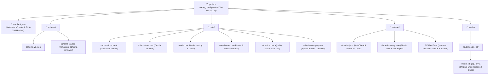
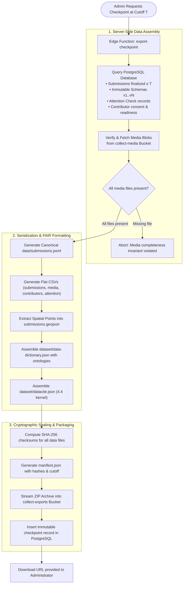

# Checkpoint export format

A **checkpoint** is an immutable server snapshot of complete submissions finalized at or before a specified cutoff timestamp. Each export creates a new checkpoint record and an independent, self-contained ZIP archive.

Archives are assembled in memory. A project whose media exceeds `EXPORT_MAX_ARCHIVE_BYTES` (default 512 MiB) is refused with an explicit 413 error rather than crashing the function; split the project or raise the limit for very large datasets.

---

## Package structure



```text
project-name_checkpoint-YYYY-MM-DD.zip
├── manifest.json
├── schema/
│   ├── schema-v1.json
│   └── schema-v2.json          # Every immutable schema version used in this dataset
├── data/
│   ├── submissions.jsonl       # Canonical dataset: one complete JSON object per line
│   ├── submissions.csv         # Flat CSV view (nested payloads stored as JSON strings)
│   ├── media.csv               # Media metadata and export paths
│   ├── contributors.csv        # Contributor roster, consent status, and readiness
│   ├── attention.csv           # Attention-check audit results
│   └── submissions.geojson     # Point features from observations with location fields
├── dataset/
│   ├── datacite.json           # DataCite 4.4 kernel metadata (DOI-ready)
│   ├── data-dictionary.json    # Complete dictionary of fields, units, and ontology hooks
│   └── README.md               # Dataset documentation, license, and contact details
└── media/
    └── {submission_id}/
        └── {media_id}{ext}     # Original raw media files (never recompressed)
```

---

## Top-level files

### 1. `manifest.json`

Contains checkpoint metadata, dataset counts, and SHA-256 integrity checksums:

```json
{
  "export_format_version": "1",
  "software_version": "0.1.2",
  "project": {
    "id": "project-uuid",
    "organization_id": "org-uuid",
    "name": "Forest Ecology Survey",
    "status": "active"
  },
  "organization": {
    "id": "org-uuid",
    "name": "Field Research Lab",
    "logo_path": null
  },
  "checkpoint_id": "checkpoint-uuid",
  "created_at": "2026-08-10T09:00:00.000Z",
  "cutoff_server_timestamp": "2026-08-10T09:00:00.000Z",
  "schema_versions": [1, 2],
  "submission_count": 12,
  "media_count": 31,
  "hashes": {
    "submissions_jsonl_sha256": "sha256-hex-hash",
    "media_csv_sha256": "sha256-hex-hash"
  },
  "dataset": {
    "license": "CC-BY-4.0",
    "contact_email": "dataset@lab.org",
    "dataset_identifier": "10.5281/zenodo.0000000"
  },
  "contributor_readiness": [
    {
      "device_id": "device-uuid",
      "contributor_id": "user-uuid",
      "last_seen_at": "2026-08-09T08:00:00.000Z",
      "last_sync_success_at": "2026-08-09T08:00:00.000Z",
      "pending_submissions": 0,
      "pending_media": 0,
      "fieldwork_complete": true
    }
  ],
  "note": "A checkpoint contains only complete submissions received by the server at the cutoff timestamp. Offline devices may hold additional unseen data."
}
```

---

## Data files (`data/`)

### 1. `data/submissions.jsonl` (Canonical)

The primary machine-readable format. Each line represents one complete submission ordered by `server_received_at`:

```json
{
  "id": "submission-uuid",
  "project_id": "project-uuid",
  "schema_id": "schema-uuid",
  "contributor_id": "user-uuid",
  "device_id": "device-uuid",
  "payload": {
    "site_code": "VA-023",
    "location": { "latitude": 41.65, "longitude": -4.72, "accuracy": 8 }
  },
  "client_created_at": "2026-08-09T07:42:11Z",
  "client_timezone": "Europe/Madrid",
  "server_received_at": "2026-08-09T07:45:02Z",
  "status": "COMPLETE",
  "finalized_at": "2026-08-09T07:45:02Z",
  "app_version": "0.1.2",
  "environment": {
    "deviceModel": "iPhone",
    "deviceOs": "iOS",
    "browser": "Safari",
    "timezone": "Europe/Madrid"
  },
  "attention_failed": false,
  "collected_after_remote_close": false,
  "corrects_submission_id": null,
  "media": [
    {
      "id": "media-uuid",
      "field_id": "site_photos",
      "mime_type": "image/jpeg",
      "byte_size": 3120441,
      "original_filename": "IMG_0001.jpg",
      "sha256": null,
      "captured_at": "2026-08-09T07:41:55Z",
      "capture_source": "picker",
      "status": "UPLOADED",
      "export_path": "media/{submission_id}/{media_id}.jpg"
    }
  ]
}
```

### 2. `data/submissions.geojson`

Contains point features extracted from top-level `location` fields with full property metadata.

### 3. `data/submissions.csv` and `data/media.csv`

Tabular exports for spreadsheet tools. Structured sub-objects and arrays remain serialized as JSON strings to avoid data loss.

### 4. `data/attention.csv`

Contains audit records for all attention checks completed in this dataset:

```text
submission_id, contributor_id, project_id, check_key, selected_value, correct, guess_probability, created_at
```

The check prompt is never stored in observation rows; only the stable `check_key` is exported.

---

## Research metadata (`dataset/`)

- **`dataset/datacite.json`**: DataCite 4.4 kernel metadata schema, ready for DOI registration (e.g. Zenodo, Figshare).
- **`dataset/data-dictionary.json`**: Machine-readable listing of all fields across every schema version, including units, choice codes, and `semantic_uri` ontology links.
- **`dataset/README.md`**: Human-readable guide containing project description, license terms, contact emails, and citation guidelines.

---

## Data integrity guarantees



1. **Deterministic hashing**: `manifest.json` contains SHA-256 hashes of `data/submissions.jsonl` and `data/media.csv`.
2. **Media completeness**: A checkpoint succeeds only if every referenced media file downloads successfully from storage.
3. **Immutability**: Checkpoint records cannot be updated. Generating a new export creates a separate archive.

---

## Related documentation

- [FAIR dataset standards](dataset-standards.md)
- [Attention verification](attention-qa.md)
- [Architecture](architecture.md)
