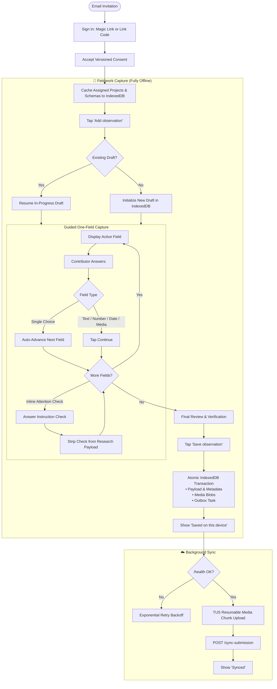
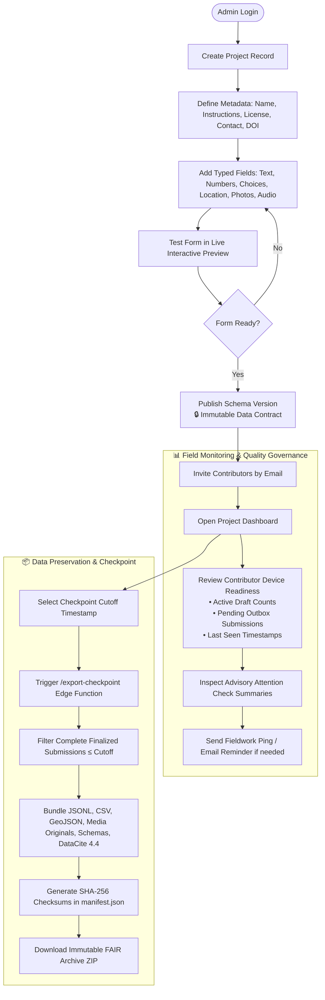
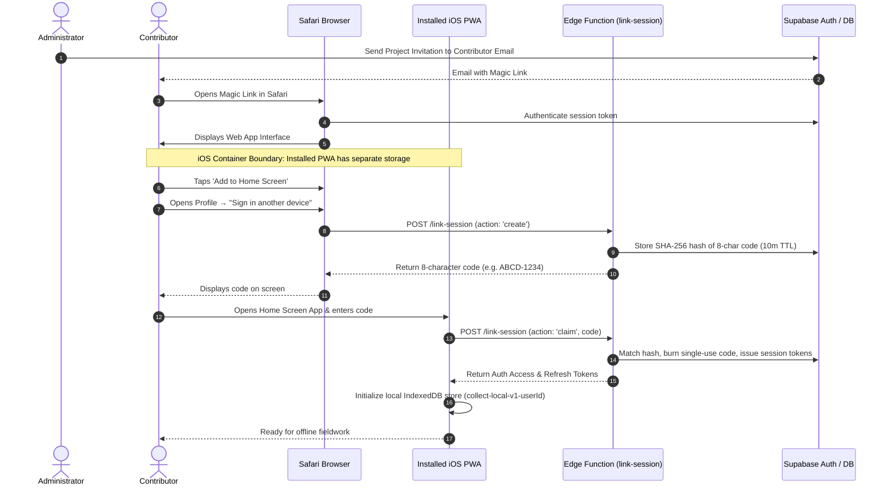
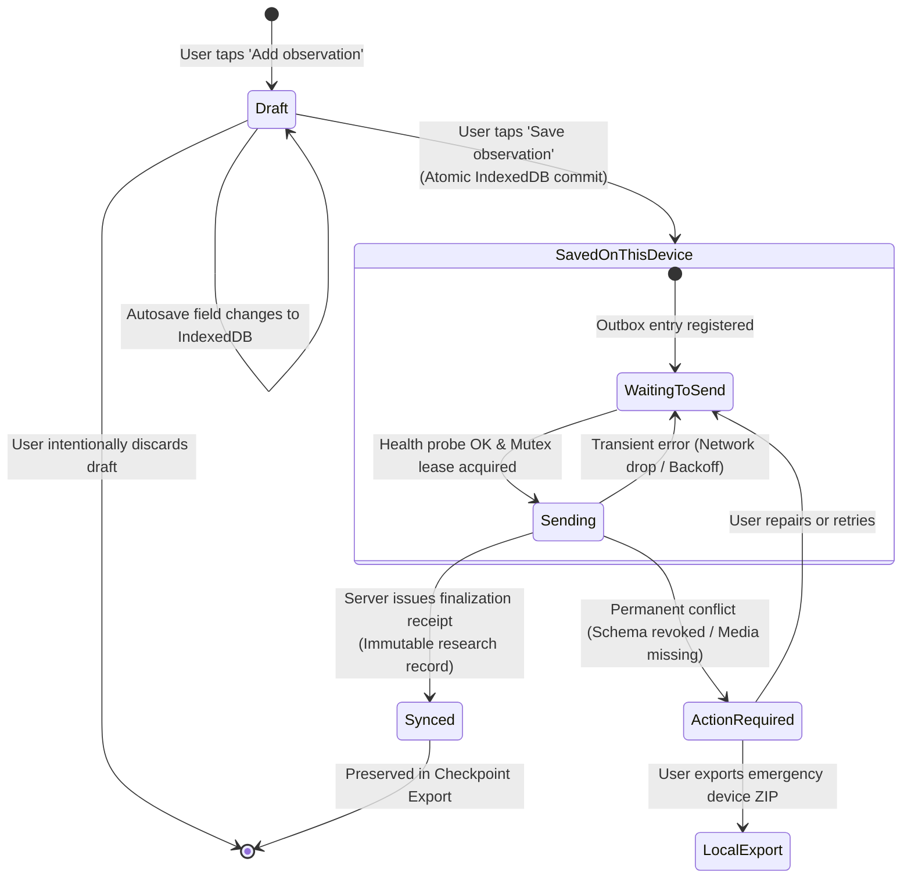

# User and system flows

This document describes the primary user workflows and system state transitions in `collect`. UI labels appear in **bold**; code symbols and states appear in `code`.

---

## Contributor workflow

### 1. Onboarding and sign-in

1. The administrator invites the contributor to a project by email; the invitation email creates the account on first open.
2. The administrator issues a **sign-in code** from the roster (**Contributors → ⋯ → Issue sign-in code**); the single-use, 20-minute code is emailed to the contributor and shown to the administrator for in-person sharing.
3. The contributor signs in by entering the 8-character code on the login screen (**Sign in with a code**). Returning contributors can request a fresh code by email from the same screen (invite-only, uniform response).
4. The contributor reviews the privacy disclosure and accepts the versioned consent.
5. On iOS, the contributor adds `collect` to the Home Screen. Because iOS runs installed web apps in an isolated storage container, the app requires its own authentication session (device-link codes from **Profile → Sign in another device** still bridge a signed-in browser to the installed app).
6. The app downloads assigned project definitions and published schemas into IndexedDB for offline use.

### 2. Capturing an observation

1. Tap **Add observation** on the project card.
2. The client opens or resumes a durable draft in IndexedDB.
3. Complete one field at a time. Single-choice fields advance automatically; text, numbers, dates, and media wait for manual advance (**Continue**).
4. Skip empty optional fields by tapping **Skip**. The software keyboard never focuses empty optional fields automatically.
5. If the schema includes a location field, the app requests location permissions before questions begin.
6. Tap **Home** at any time to pause. The draft remains safe locally. From the home screen, tap **Resume observation** or **Discard and start new**.
7. Tap **Save observation** on the final screen.
8. The client validates required fields and commits the submission, media blobs, and outbox operations in a single IndexedDB transaction.
9. The interface displays **Saved on this device** only after this local transaction completes.

### 3. Background synchronization

1. The lifecycle manager detects pending work in the outbox.
2. The client checks server reachability via the `/health` endpoint.
3. A cross-tab mutex lease elects one active sync worker.
4. The client uploads metadata, sends media files via resumable TUS, and calls the finalization endpoint.
5. The server validates contributor consent, project membership, payload hashes, and media completeness.
6. The server returns a signed finalization receipt.
7. The client matches the receipt and updates the local record status to `SYNCED`.
8. Transient errors retry automatically with exponential backoff. Irrecoverable conflicts transition to `ACTION_REQUIRED`.

### 4. Local data recovery

1. Open **Profile → Data and privacy → Export local data copy** (or use the pre-login recovery mode).
2. The client reads IndexedDB directly and exports a ZIP archive of unsynced drafts, submissions, media blobs, and logs.
3. The recovery archive saves directly to the device storage.

---

## Administrator workflow

### 1. Creating and publishing projects

1. Enter the project name (the only mandatory field).
2. Optionally enter field instructions, dataset license (SPDX identifier), contact email, and DOI.
3. Add typed fields (text, numbers, choice lists, coordinates, photos, audio).
4. Test the form in the live interactive preview.
5. Publish the schema. Published schema versions are immutable.
6. Invite contributors by entering their email addresses.

### 2. Monitoring fieldwork

1. Open the project dashboard to review contributor rosters and device readiness.
2. Readiness aggregates active drafts and unsynced outbox counts across all known contributor devices.
3. The dashboard highlights items needing attention; healthy background sync details remain collapsed.
4. Review advisory attention summaries (quality metadata that never alters or deletes research records).
5. Send email reminders to contributors with pending unsynced records.

### 3. Exporting checkpoint archives

1. Select **Export checkpoint** at a chosen cutoff timestamp.
2. The server filters complete submissions finalized at or before the cutoff.
3. The export engine bundles JSONL data, CSV tables, GeoJSON layers, raw media, schemas, and DataCite metadata into a ZIP file.
4. The administrator downloads the immutable checkpoint archive.

---

## Authentication matrix

| Client context               | Primary method                                            | Fallback method        |
| :--------------------------- | :-------------------------------------------------------- | :--------------------- |
| **Contributor (any device)** | 8-character sign-in code (admin-issued or self-service)   | Password (if set)      |
| **Installed iOS PWA**        | Sign-in code or device-link code from a signed-in browser | Password (if set)      |
| **Administrator**            | Invitation link + password setup                          | Magic link / email OTP |

Contributor sign-in codes and device-link codes share the same bridge: they
are 8 characters from an unambiguous alphabet (32⁸ ≈ 1.1×10¹²), single-use
with an atomic consume, expire after 20 minutes (device links: 5), are
stored only as SHA-256 hashes, and invalidate after 10 failed attempts.
Minting is throttled to 3 codes per user per 20 minutes and every issuance
is written to `audit_events`.

---

## Software keyboard handling

Mobile viewports require strict keyboard management:

1. An app-level `visualViewport` listener tracks viewport height and offset changes.
2. Form containers and modal sheets dynamically adjust to visible screen space.
3. The primary action button remains visible above the software keyboard.
4. Empty optional fields do not autofocus to prevent unnecessary keyboard popups.

---

## Observation state transitions

| State                    | Definition                                                 | User action                                |
| :----------------------- | :--------------------------------------------------------- | :----------------------------------------- |
| **Draft**                | Observation is open for editing in local IndexedDB.        | Resume editing or deliberately discard.    |
| **Saved on this device** | Committed atomically to local IndexedDB; outbox is queued. | Continue fieldwork. Transfer is automatic. |
| **Waiting to send**      | Outbox entry is queued; waiting for network or lease.      | None required.                             |
| **Sending**              | Active sync worker is uploading metadata or media.         | None required.                             |
| **Synced**               | Server finalized the record and issued a durable receipt.  | None. Record is safely preserved.          |
| **Action required**      | Permanent conflict or missing media blocks upload.         | Open Sync details to inspect or recover.   |
