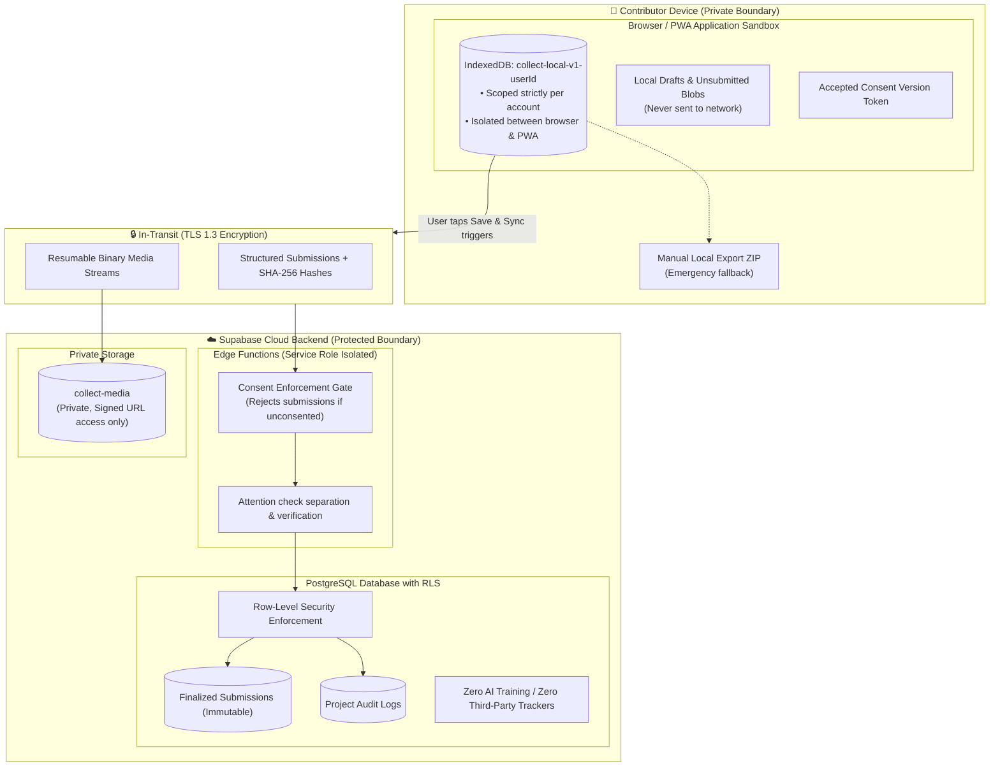

# Privacy and data handling

This document explains what data `collect` records, where it is stored, and how it is protected.

---

## Data categories

| Category              | Collected items                                       | Purpose                                                    |
| :-------------------- | :---------------------------------------------------- | :--------------------------------------------------------- |
| **Research data**     | Form inputs, text, choices, numbers, dates, groups    | Primary scientific observation records                     |
| **Media files**       | Photos and audio, filenames, file sizes, MIME types   | Primary media evidence for observations                    |
| **Location data**     | GPS coordinates, accuracy radius, capture timestamp   | Spatial provenance (only if schema requires location)      |
| **Record provenance** | Schema ID, client timestamps, timezone, device ID     | Auditability and conflict resolution                       |
| **Device context**    | OS version, browser type, battery level, network type | Operational diagnostics and field context                  |
| **User identity**     | Email address, project roles, invitation tokens       | Authentication and Row-Level Security (RLS)                |
| **Consent records**   | Consent version, acceptance and revocation timestamps | Server-enforced collection compliance                      |
| **Attention quality** | Check ID, selected choice, pass/fail result, score    | Advisory data-quality metrics (never alters research data) |
| **Device readiness**  | Unsynced submission counts, last sync timestamp       | Project dashboard readiness monitoring                     |

---

## Storage boundaries

### 1. Local device storage (IndexedDB)

- **Account isolation**: Each user account uses an independent IndexedDB database (`collect-local-v1-<userId>`).
- **iOS storage containers**: Safari and installed Home Screen PWAs run in separate sandboxes. Authentication uses device-link codes without copying local data.
- **Data retention**: Unsynced records stay in IndexedDB until finalized by the server. Users can export unsynced records locally via **Profile → Data and privacy → Export local data copy**.

### 2. Server storage (Supabase)

- **PostgreSQL**: Structured submissions, provenance metadata, and consent records.
- **Supabase Storage**: Original media blobs stored in private access-controlled buckets (`collect-media`).
- **Edge Functions**: Privileged operations execute server-side; service-role keys are never sent to the browser.
- **Immutability**: Published schemas and finalized submissions cannot be modified through the client API.

---

## Data collection rules

1. **Explicit consent**: The server rejects submissions from accounts without active, non-revoked consent.
2. **Contextual location**: The app requests location access only if the active project schema includes a location field. Projects without location fields never request GPS access.
3. **No AI transformations**: The collection path stores verbatim contributor entries without automated alteration.
4. **Attention separation**: The synthetic attention check field (`_attention`) is stripped from research data before hashing and storage.
5. **Access revocation**: Removing a contributor from a project revokes their
   server membership, pending invites, and device-readiness rows. Their
   research records (submissions, media, attention responses) remain in the
   dataset, and observations already saved on their device stay local and
   remain exportable from **Profile**.

---

## Logging and security practices

Application and server logs never record:

- Research responses or text payloads.
- Precise GPS coordinates.
- Raw media URLs or media content.
- Passwords, magic link tokens, device-link codes, or service-role keys.

---

## Related documentation

- [Architecture](architecture.md): Authorization, storage isolation, and receipt boundaries.
- [Checkpoint export format](export-format.md): Exported personal data and provenance fields.
- [Attention verification](attention-qa.md): Stored fields, scoring formulas, and ethical limits.
- [Deployment](deployment.md): Operator setup and secret management.
