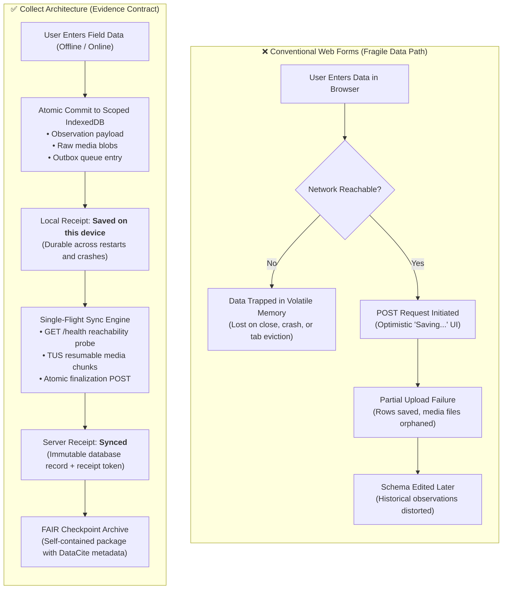

# Product value and fit

`collect` is offline-first infrastructure for field evidence. It is built for research and operations teams where lost, delayed, or corrupted observations have high costs.

---

## Core problem

Field operations frequently encounter unreliable mobile connectivity. Conventional web forms fail in several predictable ways:

| Failure mode                 | Risk in conventional forms                   | Solution in `collect`                                                     |
| :--------------------------- | :------------------------------------------- | :------------------------------------------------------------------------ |
| **Network dependency**       | Work entered offline is lost or delayed.     | Complete local capture, storage, and outbox in IndexedDB.                 |
| **Premature "Saved" status** | UI indicates success before durable storage. | **Saved on this device** displays only after atomic local commit.         |
| **Transient retry queues**   | Closing the browser clears pending uploads.  | Durable outbox survives restarts and browser closes.                      |
| **Schema mutation**          | Schema edits distort historical data.        | Published schema versions are immutable.                                  |
| **Orphaned media**           | Form rows upload while media files fail.     | Server validates media completeness before finalization.                  |
| **Incomplete exports**       | Exports lack schema history and provenance.  | Self-contained checkpoints include JSONL, schemas, and DataCite metadata. |

---

## The evidence contract

### 1. Saved means locally durable

The client commits the observation payload, media references, blobs, and outbox tasks to IndexedDB in a single transaction before displaying **Saved on this device**.

### 2. Synced means server-finalized

The client updates status to `SYNCED` only after the server finalizes metadata, verifies media completeness, and returns a matching signed receipt.

### 3. Preserved interpretation

Published schema versions are immutable. Every observation permanently references the exact schema version active when captured.

### 4. Portable FAIR exports

Checkpoints contain canonical JSONL, CSV, GeoJSON, raw original media, schema definitions, and DataCite 4.4 metadata. Data remains understandable without proprietary software.

---

## Target use cases

| Team type                                | Primary benefits                                                                                 |
| :--------------------------------------- | :----------------------------------------------------------------------------------------------- |
| **Ecological & biodiversity monitoring** | Long offline transects, automated location provenance, original photos, repository-ready exports |
| **Infrastructure & building surveys**    | Multi-contributor field teams, typed schema enforcement, account isolation on shared devices     |
| **Humanitarian & disaster assessment**   | Poor connectivity resilience, local recovery export, clear sync status                           |
| **Citizen-science research**             | Simple guided mobile interface, invite-only access, centralized data curation                    |
| **Academic & institutional research**    | DataCite kernel metadata, SPDX licensing, FAIR compliance, self-hosted privacy                   |

---

## When to choose a different tool

`collect` is intentionally focused. A general-purpose survey tool or spreadsheet is a better fit for:

- Complex nested conditional branching with hundreds of question types.
- Direct spreadsheet table editing by field contributors.
- Real-time collaborative document editing.
- Unstructured, un-schemaed note taking.

---

## Key implementation references

| System layer                  | Implementation file                                    |
| :---------------------------- | :----------------------------------------------------- |
| **Local database primitives** | `src/lib/localDatabase.ts`                             |
| **Ledger, media, and outbox** | `src/lib/localStore.ts`                                |
| **Local submission boundary** | `src/app/submission.ts`                                |
| **Sync engine & protocol**    | `src/app/syncController.ts`, `src/lib/syncProtocol.ts` |
| **Ingestion Edge Function**   | `supabase/functions/sync-submission/index.ts`          |
| **Export Edge Function**      | `supabase/functions/export-checkpoint/index.ts`        |
| **Security migrations & RLS** | `supabase/migrations/`                                 |

---

## Related documentation

- [User and system flows](flows.md)
- [Architecture](architecture.md)
- [Privacy and data handling](privacy.md)
- [Background automation](background-automation.md)
- [Checkpoint export format](export-format.md)
